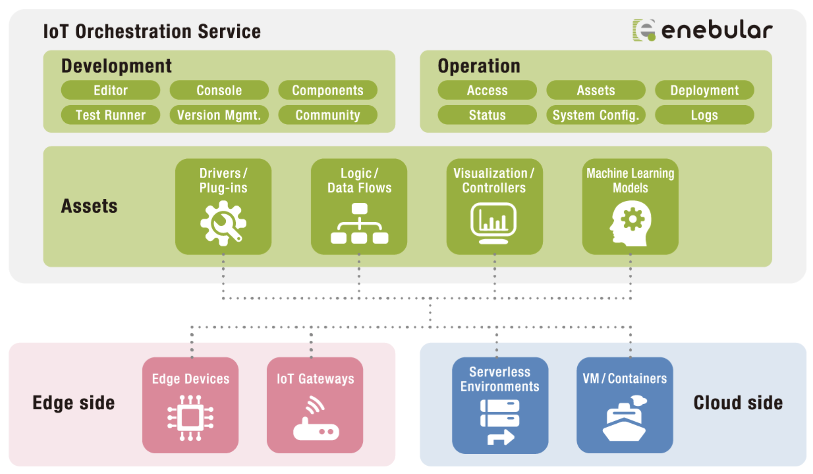
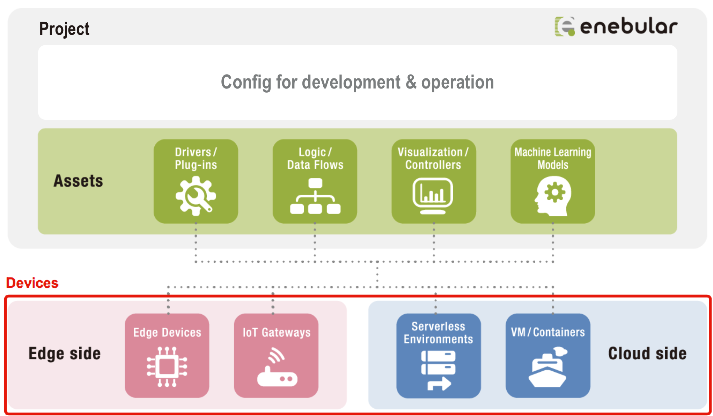
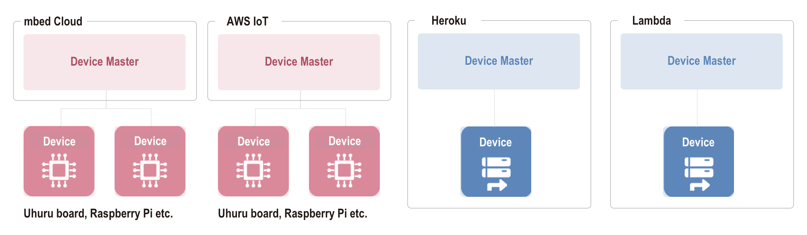

# Introduction {#Introduction}

enebular（エネブラー）は、IoT 製品・サービスづくりを包括的に支援する、開発・運用サービスです。

enebular で扱うものには大まかに以下の 3 つがあります。

- **アセット**: プロジェクトが持つ資産のことです。ロジック／データフローやデータの可視化やコントロールを行うダッシュボードのほかに機械学習モデルなどが含まれます。
- **デバイス**: アセットをデプロイするデバイスのことです。デバイスにはエッジ（マイコンなど）とクラウド（サーバレス環境や VM など）の両方が含まれます。
- **その他設定**: 運用や開発に必要な設定（可視化を行うデータのデータソースやアクセス権限）などを指します。

enebular の主な利用方法は、**enebular.com でアセットを開発して、開発が終わったものをそれぞれデバイスへデプロイして運用する**、というふうになるかと思います。

## アセット {#アセット}

現在利用できるアセットは以下になります（その他にも、機械学習モデルなど対応予定のアセットがあります）。

- [Flow](Flows/Introduction.md): Node-RED で作成するデータフローのことです
- [File](Files/Introduction.md): デバイス用の実行ファイル、設定ファイル、画像、動画ファイル等です。Enterprise Plan（有料プラン）でのみ利用可能です
- [AI Model](AIModels/Introduction.md): 機械学習・ディープラーニングのモデル等です。Enterprise Plan（有料プラン）でのみ利用可能です
- [InfoMotion](InfoMotion/Introduction.md): グラフの可視化やデバイスへのコントロールを行うダッシュボードのことです
- [InfoType](InfoMotion/InfoTypeIntroduction.md): InfoMotion で利用するグラフやコントローラーの型です。

それぞれの詳細な情報は以下になります。

|                | 概要                                           | 実体                                                               | デプロイ場所（運用する場所）                     |
| -------------- | ---------------------------------------------- | ------------------------------------------------------------------ | ------------------------------------------------ |
| **Flow**       | Node-RED のフロー                              | JSON とクレデンシャル情報                                          | Node-RED が動作する実行環境                      |
| **File**       | 実行ファイル、設定ファイル、画像、動画等       | 任意のファイル                                                     | enebular-agent が動作する環境                    |
| **AI Model**   | 機械学習・ディープラーニング等のモデルファイル | Zip ファイル                                                       | enebular-agent が動作する環境                    |
| **InfoMotion** | ダッシュボード                                 | 利用するデータソース情報・利用する InfoType 情報・パネルの配置情報 | Web サイト（iframe 貼り付け）                    |
| **InfoType**   | プラグインファイル                             | JavaScript, CSS                                                    | InfoMotion で利用（InfoType 単体では利用しない） |

## デバイス {#デバイス}

外部のサービスと連携することで、開発したアセットをデバイスにデプロイできます。現在以下のようなサービスが利用可能です。

- [Pelion Device Management](https://cloud.mbed.com/)
- [AWS IoT](https://aws.amazon.com/jp/iot/)
- [AWS Lambda](https://aws.amazon.com/jp/lambda/)
- [Heroku](https://www.heroku.com/home)

これらのサービスを利用してデバイスにアセットをデプロイすることになりますが、デプロイをする際に知っておくべき概念が 2 つあります。

- **デバイス**：アセットの実行環境となるデバイス本体
- **デバイスマスター**：enebular からのデプロイのリクエストを受けてデバイスにデプロイを行ったり、デバイスの監視や enebular へのログ送信を行うデバイスのマスター

具体的なサービスを例に挙げてみましょう。

AWS IoT や Pelion Device Management などエッジデバイスにデプロイをするクラウドサービスの場合、エッジデバイスが**デバイス**となり、クラウドサービス自体は**デバイスマスター**となります。

Heroku や AWS Lambda などクラウド上に実行環境が存在する場合は、クラウドサービスが**デバイス**と**デバイスマスター**の両方の役割を担います。

センサーなど物理的な情報を必要とするアセットのデプロイは AWS IoT や Pelion Device Management を、その他の管理などが目的のアセットのデプロイは Heroku や AWS Lambda といったふうに使い分けることができます。

お問い合わせは**support@enebular.com**からお願いします。
