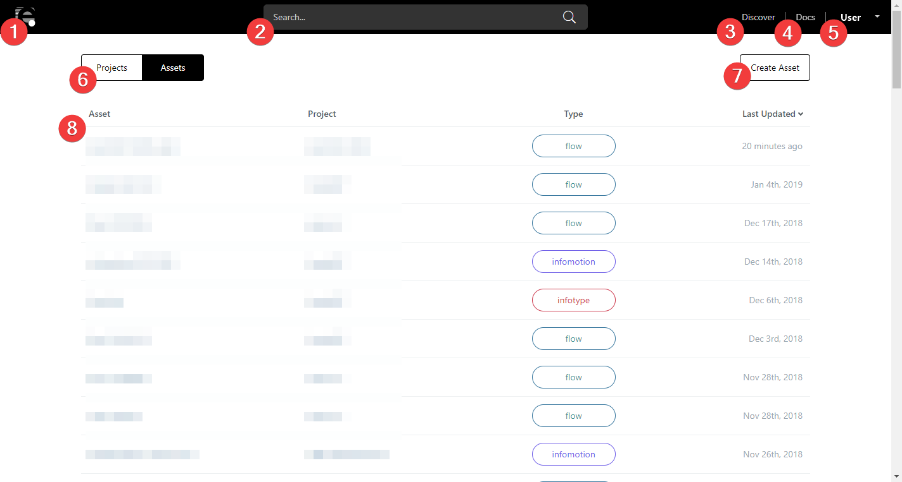

# Introduction {#Introduction}

enebular（エネブラー）は、IoT製品・サービスづくりを包括的に支援する、開発・運用サービスです。

enebular で扱うものには大まかに以下の3つがあります。

- **アセット**: プロジェクトが持つ資産のことです。ロジック／データフローやデータの可視化やコントロールを行うダッシュボードのほかに機械学習モデルなどが含まれます。
- **デバイス**: アセットをデプロイするデバイスのことです。デバイスにはエッジ（マイコンなど）とクラウド（サーバレス環境やVMなど）の両方が含まれます。
- **その他設定**: 運用や開発に必要な設定（可視化を行うデータのデータソースやアクセス権限）などを指します。

enebular の主な利用方法は、**enebular.com でアセットを開発して、開発が終わったものをそれぞれデバイスへデプロイして運用する**、というふうになるかと思います。

## アセット {#アセット}

現在利用できるアセットは以下になります（その他にも、機械学習モデルなど対応予定のアセットがあります）。

- [Flow](Flows/Introduction.md): Node-RED で作成するデータフローのことです
- [InfoMotion](InfoMotion/Introduction.md): グラフの可視化やデバイスへのコントロールを行うダッシュボードのことです
- [InfoType](InfoMotion/InfoTypeIntroduction.md): InfoMotion で利用するグラフやコントローラーの型です。

それぞれの詳細な情報は以下になります。

|  | 概要 | 実体 | デプロイ場所（運用する場所） |
| --- | --- | --- | --- |
| **Flow** | Node-RED のフロー | JSON とクレデンシャル情報 | Node-RED が動作する実行環境 |
| **InfoMotion** | ダッシュボード | 利用するデータソース情報・利用する InfoType 情報・パネルの配置情報 | Web サイト（iframe貼り付け） |
| **InfoType** | プラグインファイル |  JavaScript, CSS | InfoMotion で利用（InfoType 単体では利用しない） |

## デバイス {#デバイス}

外部のサービスと連携することで、開発したアセットをデバイスにデプロイできます。現在以下のようなサービスが利用可能です。

- [Pelion Device Management](https://cloud.mbed.com/)
- [AWS IoT](https://aws.amazon.com/jp/iot/)
- [AWS Lambda](https://aws.amazon.com/jp/lambda/)
- [Heroku](https://www.heroku.com/home)

これらのサービスを利用してデバイスにアセットをデプロイすることになりますが、デプロイをする際に知っておくべき概念が2つあります。

- **デバイス**：アセットの実行環境となるデバイス本体
- **デバイスマスター**：enebular からのデプロイのリクエストを受けてデバイスにデプロイを行ったり、デバイスの監視や enebular へのログ送信を行うデバイスのマスター

具体的なサービスを例に挙げてみましょう。

AWS IoT や Pelion Device Management などエッジデバイスにデプロイをするクラウドサービスの場合、エッジデバイスが**デバイス**となり、クラウドサービス自体は**デバイスマスター**となります。

Heroku や AWS Lambda などクラウド上に実行環境が存在する場合は、クラウドサービスが**デバイス**と**デバイスマスター**の両方の役割を担います。

センサーなど物理的な情報を必要とするアセットのデプロイは AWS IoT や Pelion Device Management を、その他の管理などが目的のアセットのデプロイは Heroku や AWS Lambda といったふうに使い分けることができます。

問い合わせは**support@enebular.com**もしくは、ダッシュボード右上のアカウント名から表示されるメニューの**Support**からお願いします。

<!-- 一旦コメントアウト
## DashBorad画面の見方 {#DashBoard画面の見方}

enebularのアカウント 登録後、ログインして表示される画面の説明をします。
アカウントの登録に関しては[Getting Started > Introduction](./GetStarted/Introduction.md)を参照して下さい。

画面上部のタブはDashboard内を移動しても固定して表示します。

| No. | 項目名 | 説明 |
| --- | --- | --- |
| 1 | enebular ロゴマーク | DashBoardのトップ画面に戻ります |
| 2 | サーチバー | 入力文字列をアクセス権の持っているassetsから検索します |
| 3 | Discover | PublishされたAssetsページに移行します。詳しくは[Discoverのマニュアルページ](./Discover/index.md)をご覧ください |
| 4 | Docs | enebular-docsを開きます。現在見ているこのページです |
| 5 | User | アカウント名が表示されます。アカウントの設定(AccountSetting)や問い合わせ(Support)に移動するメニューを開きます。サインアウトもここから行います |
| 6 | 表示切替スイッチ | 表示する項目をAssetsとProjectsで切り替えることができます |
| 7 | Createボタン | AssetまたはProjectを作成します。作成対象は表示切替スイッチに依存します |
| 8 | 項目一覧 | AssetまたはProjectが一覧できます。閲覧対象は表示切替スイッチに依存します |

-->
