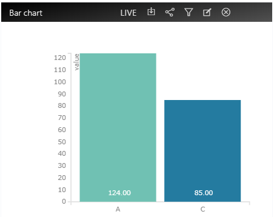

# InfoMotion ダッシュボード

DataSource の作成と InfoType のアップロードが完了したら、InfoMotioin ダッシュボード が作成できます。

enebular の管理画面の Create InfoMotion から作成できます。

- `name`：名前
- `description`：説明
- `default previllege`：デフォルトのアクセス権（詳しくは [Access](../Access/index.md)を ご覧ください）
- `category`：カテゴリー

「Add graph」を押すとグラフ作成を行うサイドバーが出てきます。以下項目を埋めましょう。

- `name`：名前
- `type`：グラフのタイプ（infomotion-toolで作成したもの）
- `datasource`：利用する DataSource
- グラフ固有のスキーマ設定

項目を埋めたら Add graph で作成後、プラスボタンでダッシュボードに追加できます。

サイドバーに複数のグラフを追加できます。

グラフは右下の角をドラッグすることで大きさを変えることができます。以下では `data logger` と `line chart` を見やすいように大きさを変えた例です。

Datarange、Timeline、Playボタン、Liveボタン を使って InfoMotion で使うデータをコントロールでいます。

- Daterange - カレンダーを使って、データの開始と終了を決めることができます。

- Timeline - Daterange より細かい日時を指定できます。

- Play - Timeline を一定時間ごとに進めます。

- Live - DataSource にデータが追加されたらデータを取得します。

また、ダッシュボードを外部に貼り付けする際には、APIを使ってカスタマイズができます。
詳細は、 [Infomotion Share](./InfoMotionTool.md) をご覧ください。

## ダッシュボードの操作

ダッシュボードでいくつかの操作ができます。

- `save` - ダッシュボードの配置を保存します。
- `filters` - データにフィルターをかけることができます。
- `share` - ダッシュボードを外部に貼り付けることができます。詳しくは [Share InfoMotion](./ShareInfoMotion.md) をご覧ください。

## グラフの操作

グラフに対してもいくつかの操作ができます。

- `download data` - グラフのデータを json 形式でダウンロードできます。
- `share infomotion` - グラフをシェアできます。
- `filter` - データにフィルターをかけることができます。
- `edit` - グラフの設定を変更できます。
- `remove` - ダッシュボードからグラフを削除します。

## フィルターの使い方

まず、以下はフィルターを使っていないグラフです。

先にダッシュボードのフィルターを設定します。フィルターは key と values のペアが必要です。

以下の画像では、 key に `country`、 values に `Japan`・`China`・`USA`を設定しています。

ダッシュボードのフィルターを設定したら、グラフでそのフィルターを使うことができます。

グラフの右上にあるフィルターアイコンからモーダルを開き、先ほど設定した key と　表示したい value を選択します。以下の例では、`country` で `China` と `USA` のみを表示するようにしています。

選択をすると、以下のように `China` と `USA` のデータのみが表示されていることが分かるかと思います。

