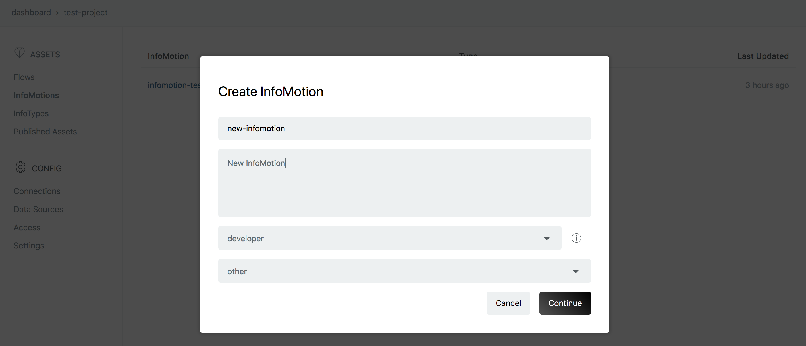
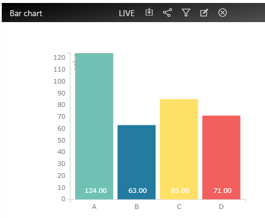

# InfoMotion ダッシュボード {#InfoMotion ダッシュボード}

DataSource の作成と InfoType のアップロードが完了したら、InfoMotioin ダッシュボード が作成できます。

enebular の管理画面の Create InfoMotion から作成できます。

- `name`：名前
- `description`：説明
- `default previllege`：デフォルトのアクセス権（詳しくは [Access](../Config/Access.md)を ご覧ください）
- `category`：カテゴリー

「Manage Graphs」を押すとグラフ作成を行うサイドバーが出てきます。「Create Graph」を押し、以下項目を埋めましょう。

- `name`：名前
- `type`：グラフのタイプ（infomotion-toolで作成したもの）
- `datasource`：利用する DataSource
- グラフ固有のスキーマ設定

項目を埋めたら Save ボタンを押すことで保存した後、Add ボタンでダッシュボードに追加できます。

サイドバーには複数のグラフを追加できます。

グラフは右下の角をドラッグすることで大きさを変えることができます。

Daterange、Timeline、Playボタン を使って InfoMotion で使うデータをコントロールできます。

- Daterange - カレンダーを使って、データの開始と終了を決めることができます。

- Timeline - Daterange より細かい日時を指定できます。

- Play - Timeline を一定時間ごとに進めます。

また、ダッシュボードを外部に貼り付けする際には、APIを使ってカスタマイズができます。
詳細は、 [Infomotion Share](./InfoMotionTool.md) をご覧ください。

## ダッシュボードの操作 {#ダッシュボードの操作}

ダッシュボードでいくつかの操作ができます。

- `Manage Graphs` - グラフの追加や削除を行います。
- `Save Layout` - ダッシュボードの配置を保存します。
- `Share` - ダッシュボードを外部に貼り付けることができます。詳しくは [Share InfoMotion](./ShareInfoMotion.md) をご覧ください。

## グラフの操作 {#グラフの操作}

グラフに対してもいくつかの操作ができます。

- `LIVE` - LIVE モードに切り替えます。赤字は LIVE モード、白字は LIVE モードではないことを表します。LIVE モード中は DataSource にデータが追加されるたびにグラフを更新します。LIVE モードを利用できる DataSource は、Firebase と PubNub です。
- `download data` - グラフのデータを json 形式でダウンロードできます。ダウンロードできるデータのサイズは最大10MBです。グラフに10MB以上のデータが表示されている場合は、10MBを超えるデータはダウンロードしません。
- `share infomotion` - グラフをシェアできます。
- `filter` - データにフィルターをかけることができます。
- `edit` - グラフの設定を変更できます。
- `remove` - ダッシュボードからグラフを削除します。

## フィルターの使い方 {#フィルターの使い方}

フィルターを利用していないグラフを以下に示します。
このグラフでは、`category` の値が `A`・`B`・`C`・`D` であるデータを使ってグラフを描画しています。

グラフ上部のフィルターボタンからフィルターを設定できます。フィルターを行うには key と values のペアを設定する必要があります。

以下の画像のフィルターでは、`category` key に割当てられた values が、 `A`・`B`・`C`・`D` の何れの場合にグラフに表示するかを設定できます。

フィルターを設定したら、グラフでそのフィルターを使うことができます。

例えば、以下のように`A`・`C`のデータのみを利用してグラフを描くように設定します。

設定すると、以下のように `A` と `C` のデータのみが表示されます。

