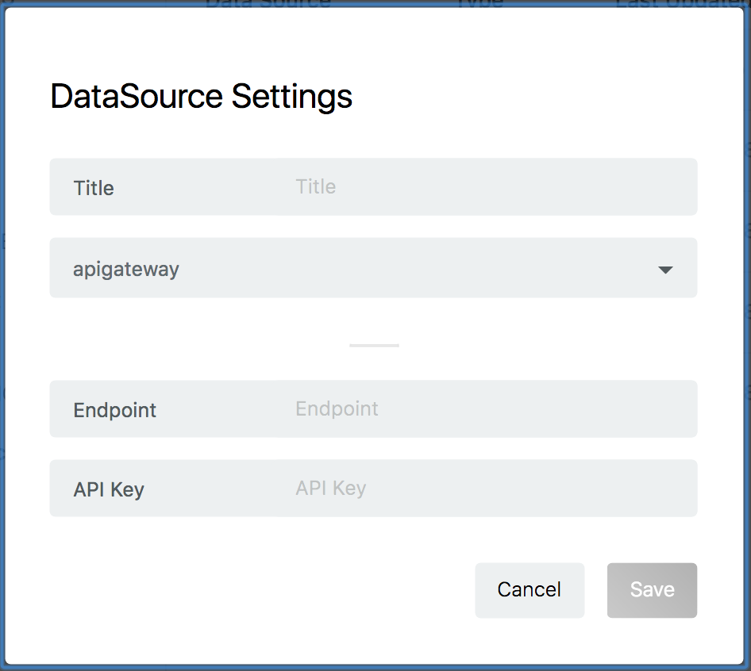
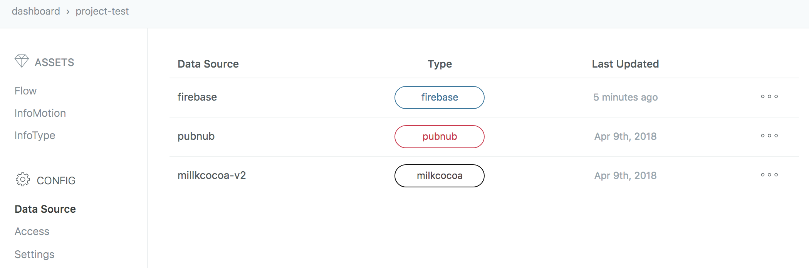
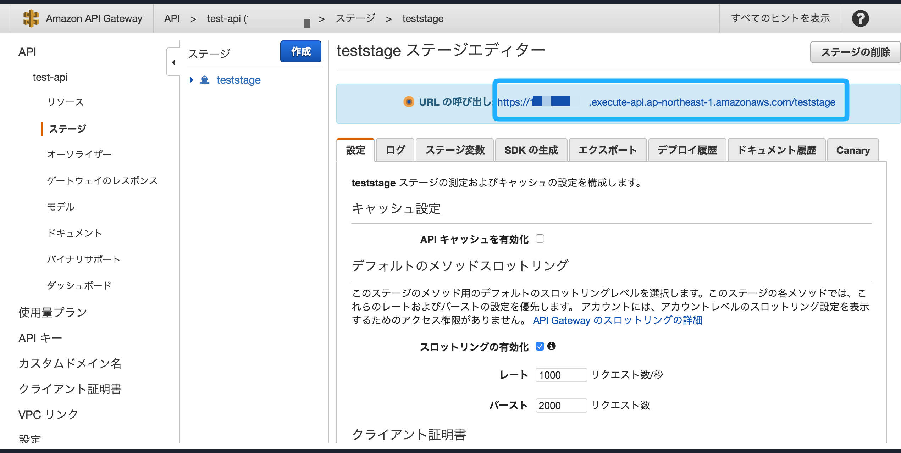
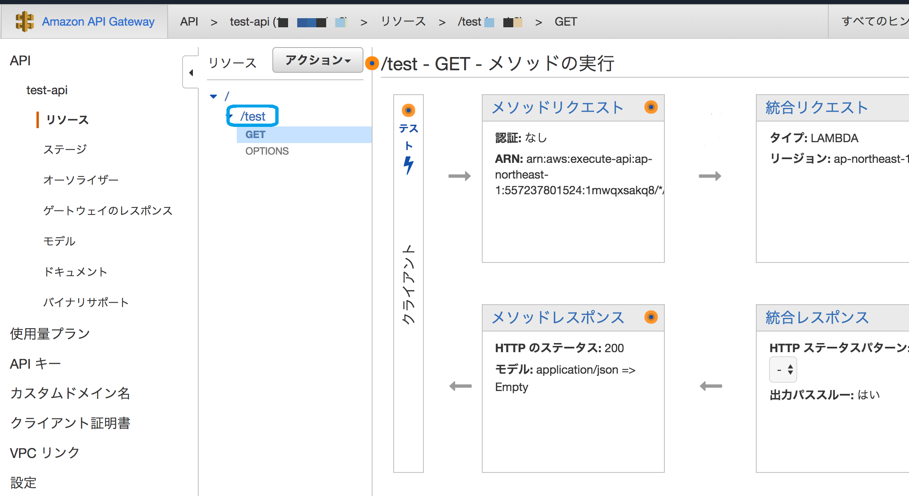
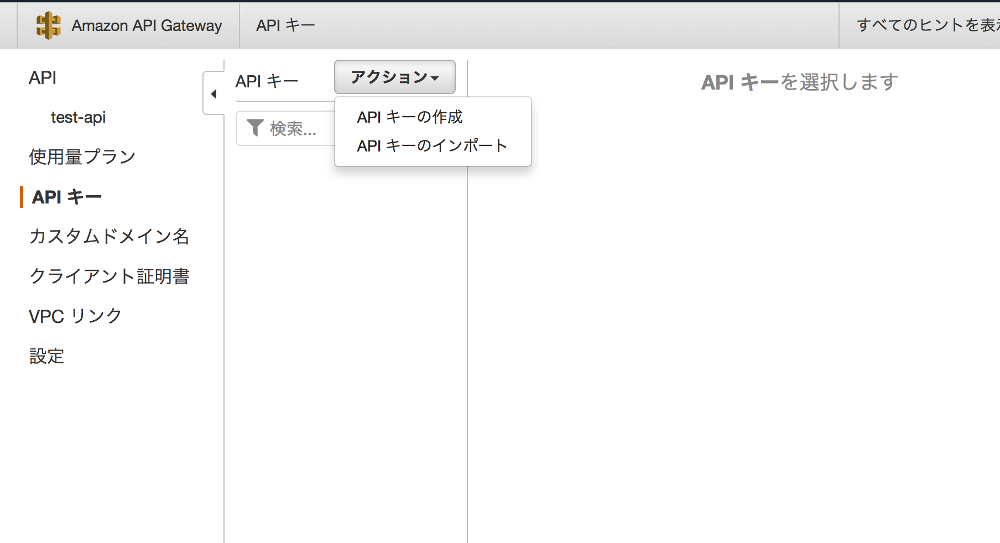
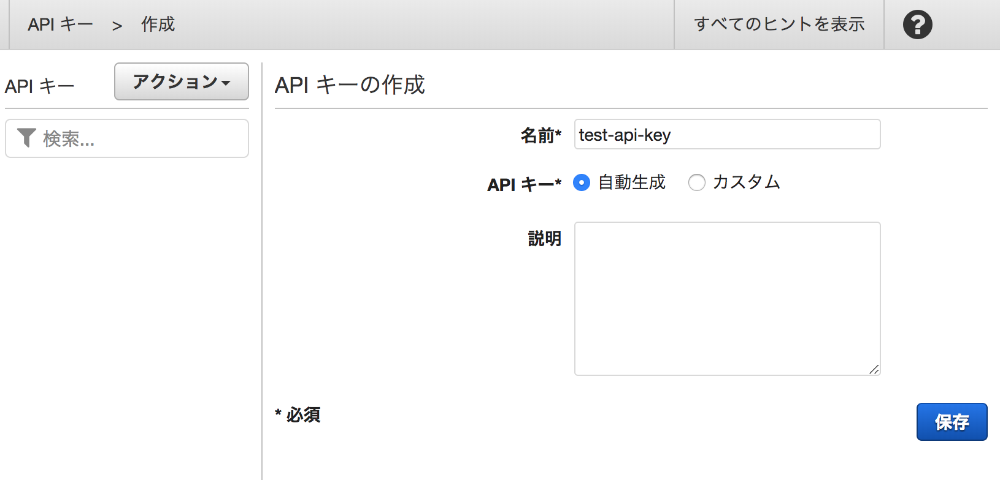
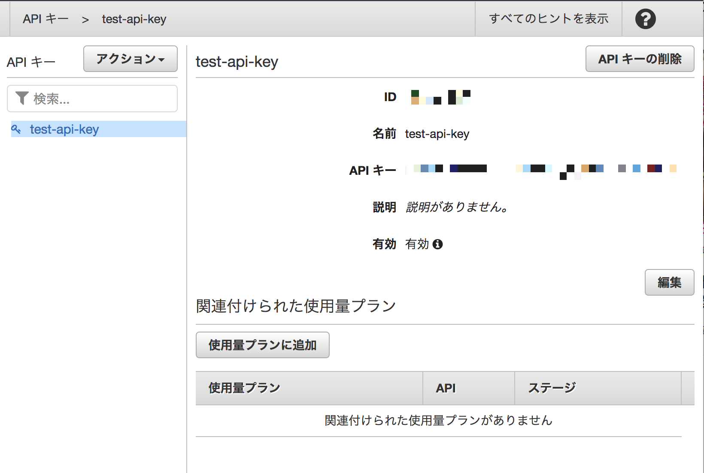

# API Gateway DataSource の作成

※ InfoMotionのライブモードは使用できません

Project のダッシュボードの左メニューの `Data Sources` をクリックし、右下のプラスボタンをクリックして新規 Data Source を作成してください。

* Endpoint
	* 下記を参考に API Gateway の Endpoint を入力してください。
* API Key
	* 下記を参考に API Gateway の API Key を作成し、入力してください。

各項目の入力が終わったら Save を押して、DataSourceを保存します。

新しくAPI GatewayのDataSourceが作成されていることを確認してください。

## Endpoint

Endpoint は `https://[固有id].execute-api.ap-northeast-1.amazonaws.com/[ステージ名]/[メソッド名]` の形式です。
[Setup & Create Lambda Function](./CreateLambdaFunction.md) で作成したAPI Gatewayを例に挙げると`https://*********.execute-api.ap-northeast-1.amazonaws.com/teststage/test`  が Endpoint として入力する URL です。

固有id 及び ステージ名は、Amazon API Gateway の [ステージ] のページより確認できます。

メソッド名 は、[リソース] のページより確認できます。

## API key

Amazon API Gateway の API Key を作成方法を説明します。
詳しくは[公式ドキュメント](https://aws.amazon.com/jp/documentation/apigateway/?icmpid=docs_menu)を参考にしてください。

登録する API Gateway の左メニューから [API キー] を選択します。
遷移したページの [アクション] をクリックし、メニューから [API キーの作成] を選択してください。

適当な名前をつけて作成します。

作成したら API キーの文字列を DataSource で登録する API Key が表示されます。

## InfoMotionの作成

DataSource を使用する準備ができました。
InfoMotion ダッシュボードを作成する際に作った DataSource を選択することでデータをグラフに反映できます。

詳しくは以下のページを順に参照してください。

* [Sample infotypes](./../../SampleInfoTypes.md)
* [Upload an InfoType](./../../UploadInfoType.md)
* [Create InfoMotion](./../../CreateInfoMotion.md)