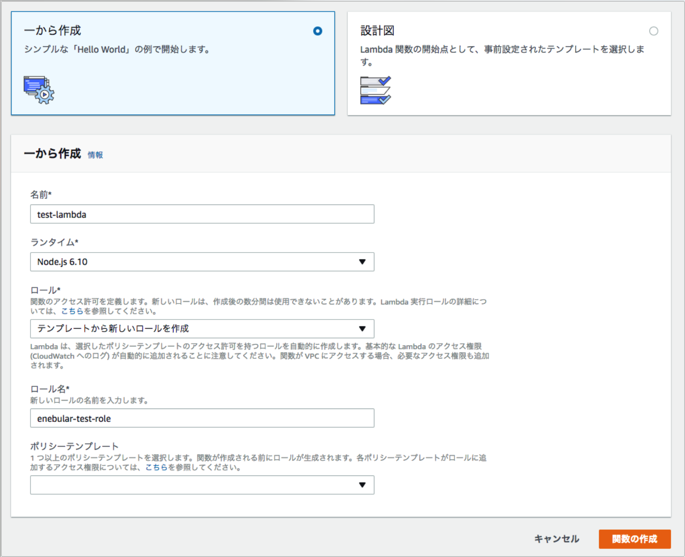
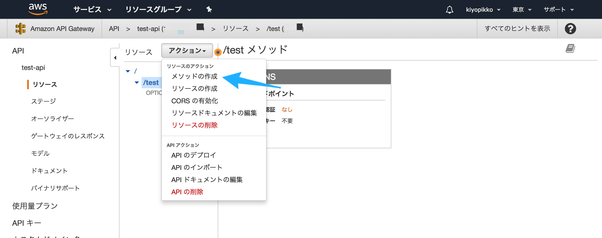
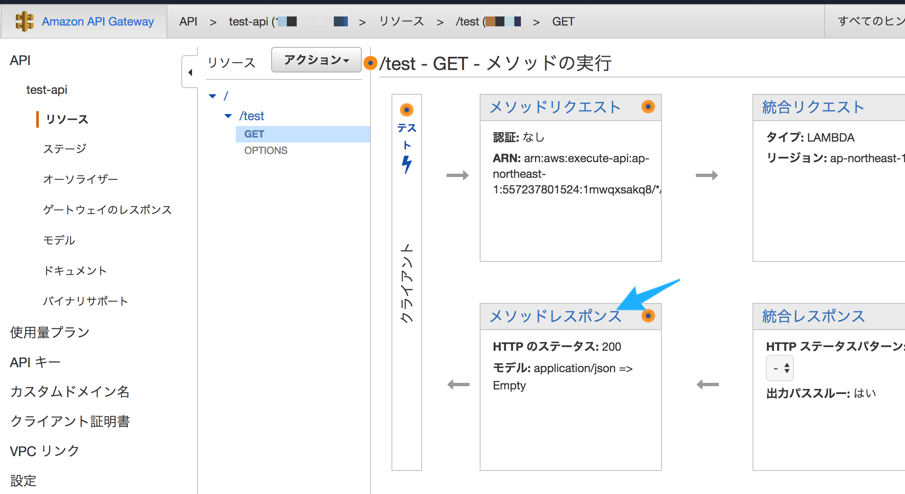
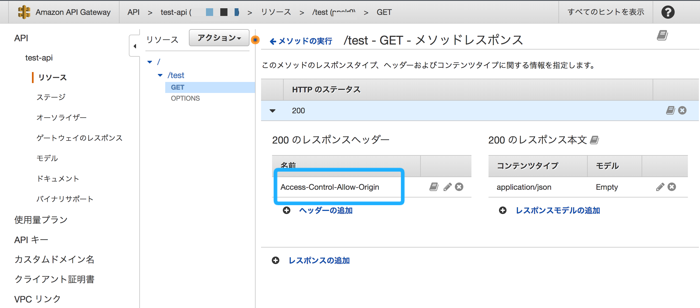
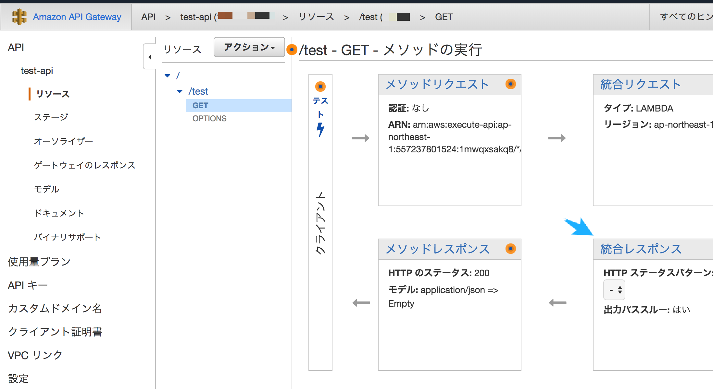
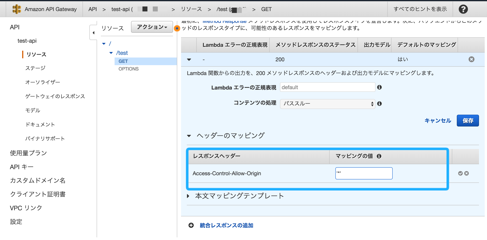
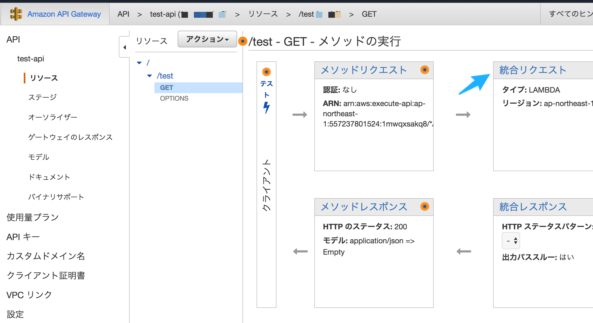
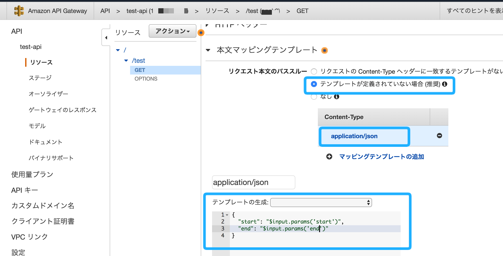
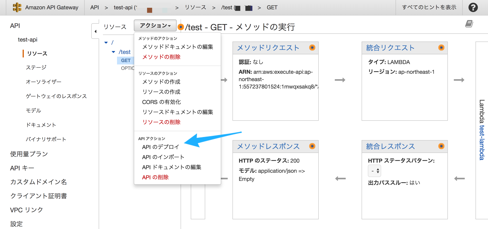
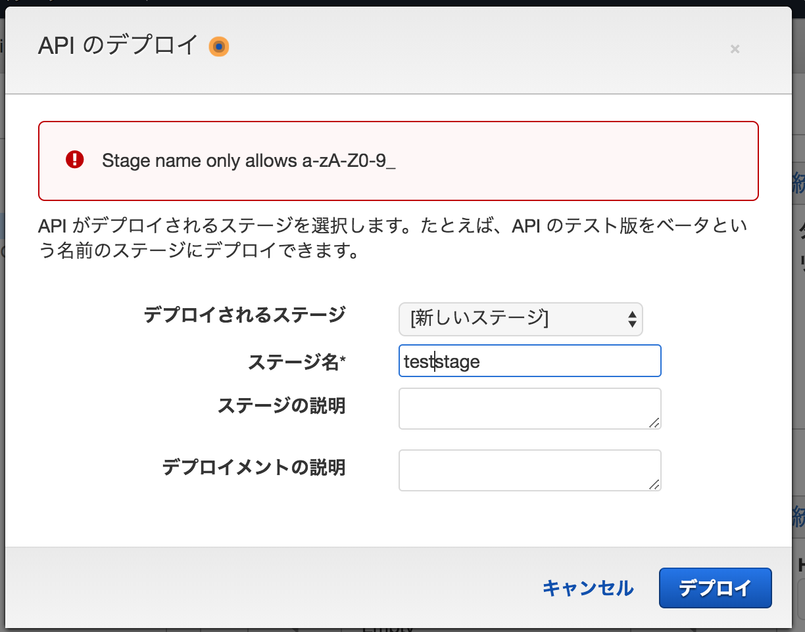

# データを返す Lambda の作成

Lambda の作成を始めます。


一から作成で Node.js バージョン 6 で Lambda を作成します。



Daterange picker の開始日時と終了日時は `start` と `end` というパラメータで渡されるので、以下のようなコードを作成します。


```javascript
exports.handler = (event, context, callback) => {
  const timeunit = (Number(event.end) - Number(event.start))/100
  const country = ['UK', 'CN', 'JP', 'NZ']
  const result = (function () {
    let arr = []
    for (var i = 100; i >= 1; i--) {
      arr.push({
        timestamp: Number(event.start) + Math.floor(timeunit*i),
        value:{
            country:country[Math.floor(Math.random()*4)],
            ss: Math.floor(Math.random()*50),
            uu: Math.floor(Math.random()*40),
            value: Math.floor(Math.random()*10),
            created:Number(event.start) + Math.floor(timeunit*i)
        }
      })
    }
    return arr
  })()
  callback(null, result);
};
```

次に作成した Lambda 関数につながる API Gateway を作成します。


新しい API で作成します。


新しいリソースを作成します。


適当なパス名を入力して、「API Gateway CORS を有効にする」にチェックを入れます。


リソースを作成したら、GET メソッドを作成します。



メソッドのセットアップをします。作成した Lamnda 関数を選択します（Lamdbaを作成したリージョンを選択しないと出てきません）。


作成したらまずは「メソッドレスポンス」を変更します。



200 のレスポンスヘッダーに「Access-Control-Allow-Origin」を追加します。



次に「統合レスポンス」を変更します。



「Access-Control-Allow-Origin」」に `'*'` を追加します。



最後に「統合リクエスト」を変更します。



以下のように「本文マッピングテンプレート」を「`application/json`」で以下のようなマッピングを作成します。

```json
{
  "start": "$input.params('start')",
  "end": "$input.params('end')"
}
```



ここまで終わったら最後に「APIのデプロイ」をします。



適当な名前をつけてデプロイします。



URL の呼び出しの URL に 今回作成したリソース名 `/test` をつけたものが DataSource で登録する endpoint になります。画像の例だと以下になります。

```
https://*********.execute-api.ap-northeast-1.amazonaws.com/teststage/test
```


