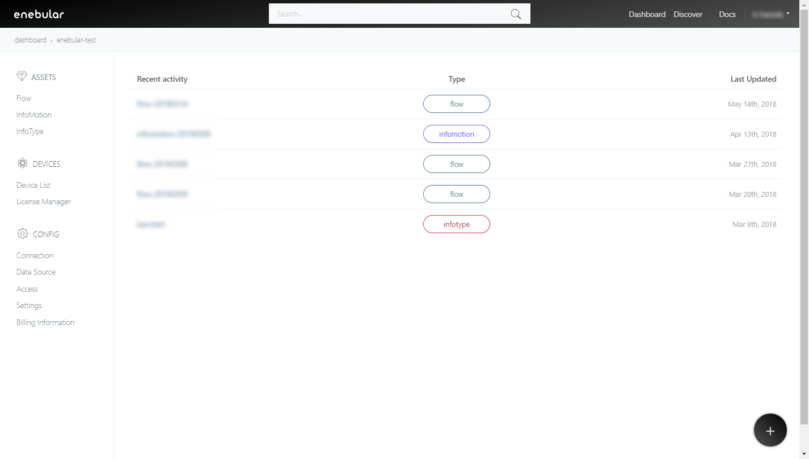
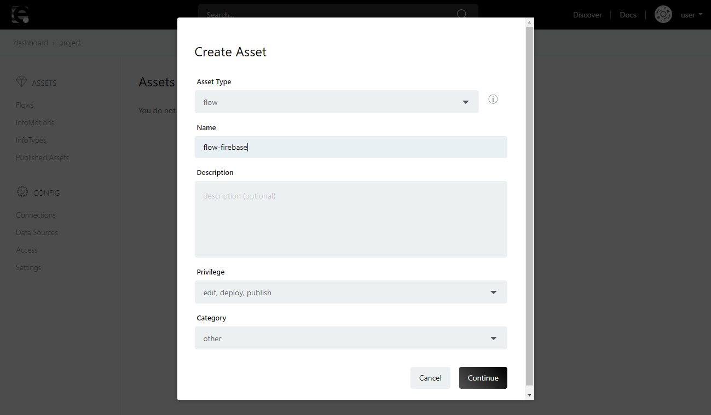
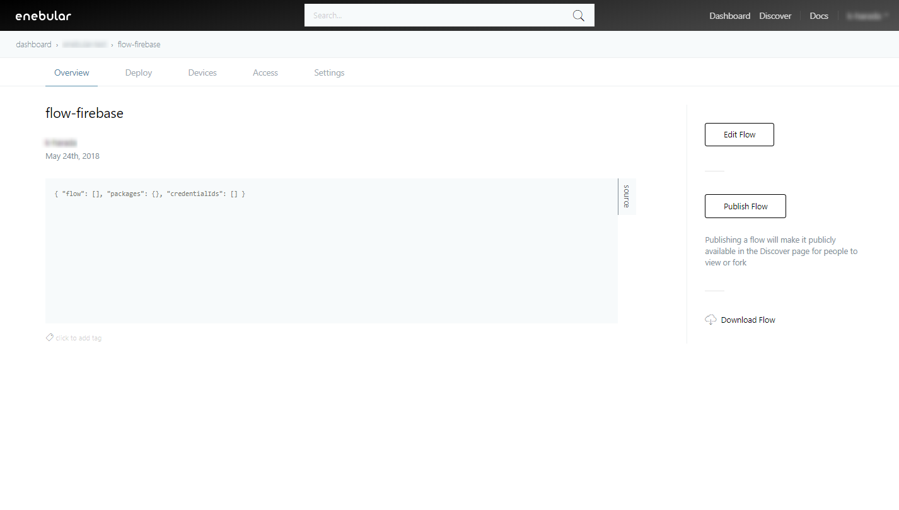
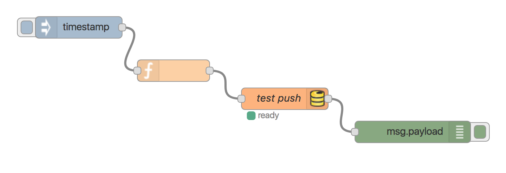
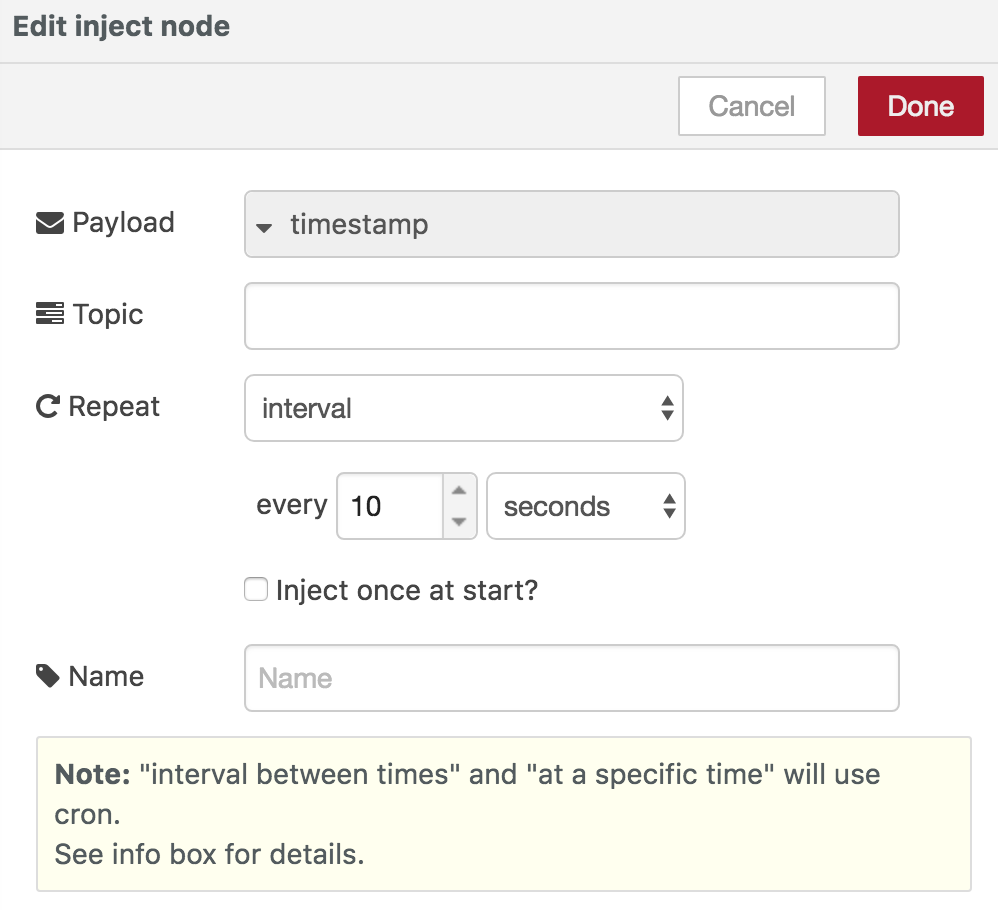
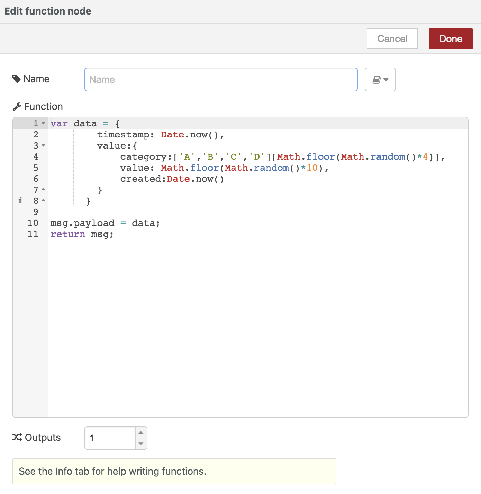
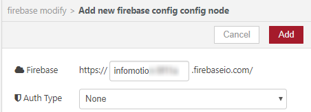
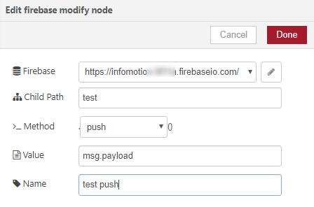
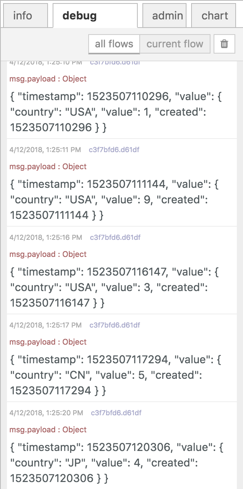
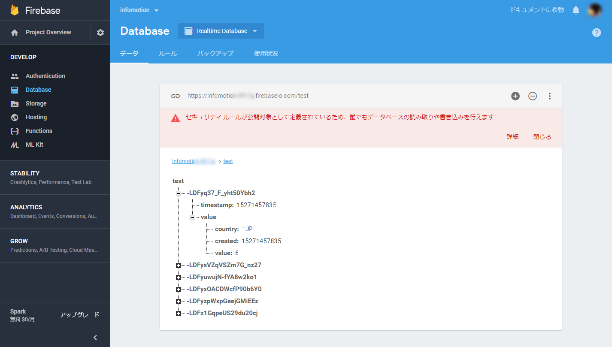

# フローの作成 {#フローの作成}

Firebase の準備ができたのでデータをプッシュするフローを作成します。
enebular のプロジェクトの右下の +ボタンをクリックし、新しいフローを作成します。




任意の名前を付けて [Continue] をクリックします。




[Edit Flow] をクリックしてフローエディターを開きます。




下記のノードを配置し、下記の画像のようなフローを作成してください。

* inject ノード
* function ノード
* firebase modify ノード
* debug ノード

(もし、Firebase のノードが存在してなかったら、 `node-red-contrib-firebase` を admin タブよりインストールしてください)




次に inject ノード(表示は timestamp )のモーダル画面を表示します。

 `repeat` を [interval] とし、every [10] seconds に設定します。
 [Done] をクリックして、モーダル画面を閉じます。




function ノードをダブルクリックして `edit function node` のモーダル画面を表示してください。
下記スクリプトをコピーして Function に貼り付けます。




```javascript
var data = {
        ts: Date.now(),
        category:['A','B','C','D'][Math.floor(Math.random()*4)],
        value: Math.floor(Math.random()*10)
      }
      
msg.payload = data;
return msg;
```


次にfirebase ノードのモーダル画面を表示します。
鉛筆のアイコンをクリックして、`Edit firebase config node` のモーダル画面を表示します。

`Firebase` には先ほど作成した Firebase プロジェクトの ID を入力してください。
`Auth Type` は [None] を選択します。設定が終わったら [Add] をクリックして保存します。




`Child path`には「test」 を入力し、`Method` は [push] を選択、`value` は「msg.payload」のままにし、 [Done] をクリックします。




全てのノードの準備ができたので、 [Deploy] を押してノードを実行します。

フローの実行ログをエディター右部のデバッグタブより閲覧できます。
下記のようなログが表示され、正しくフローが実行されていることを確認してください。




次に Firebase のページで先ほど作ったアプリからデータが追加されていることを確認します。

