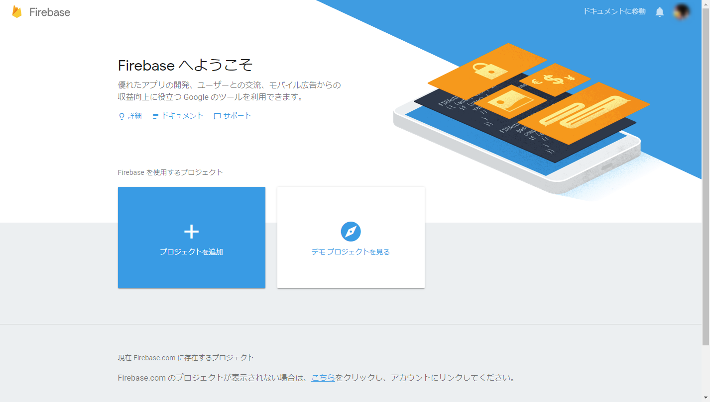
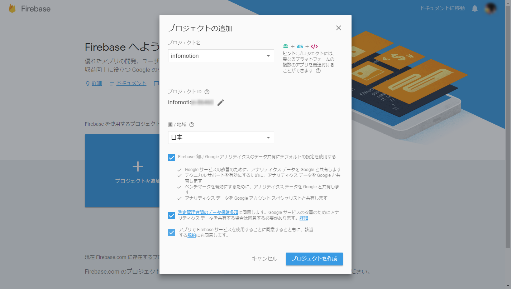
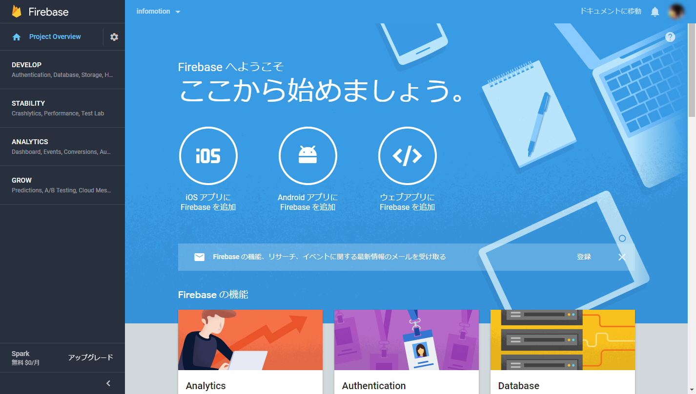
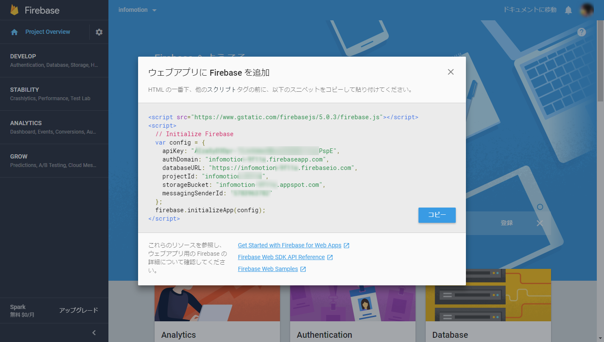
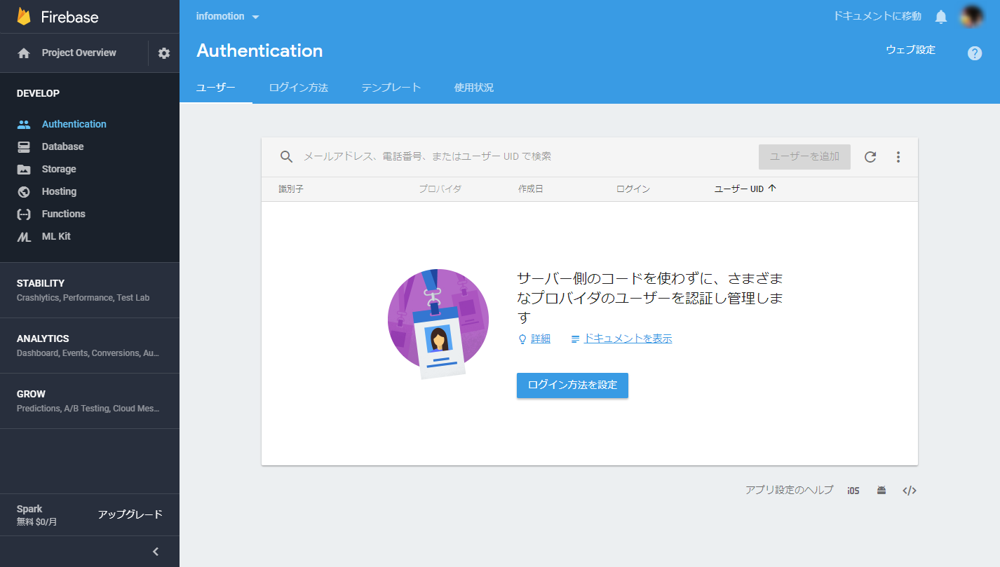
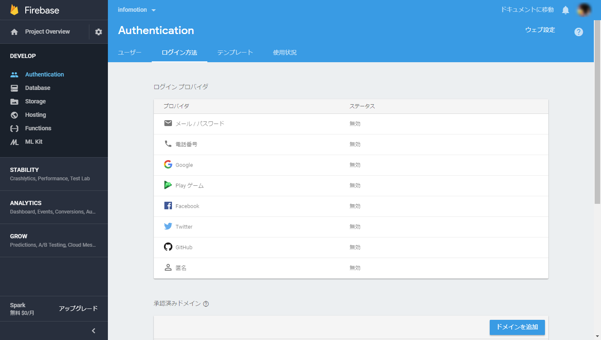
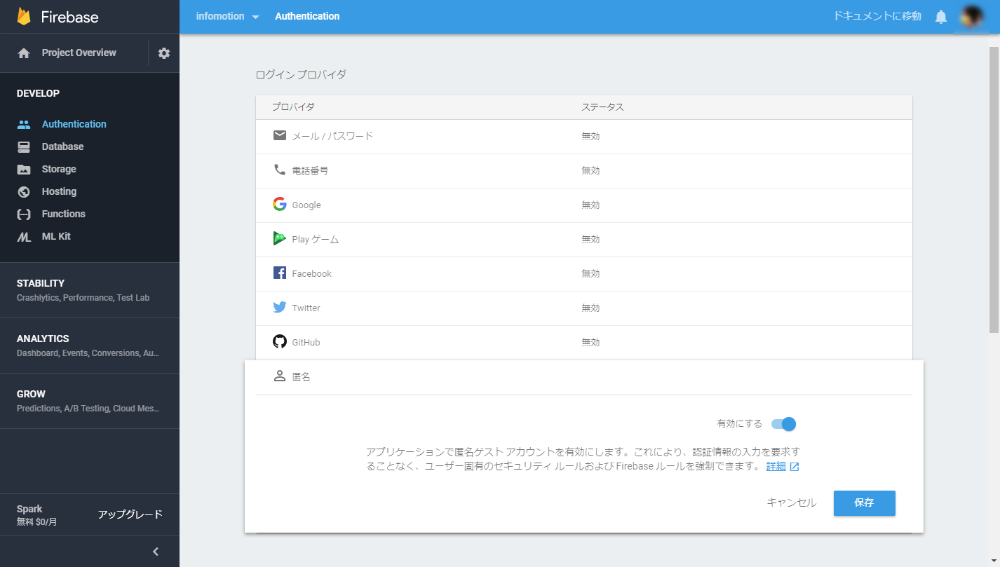
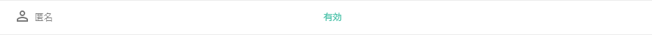
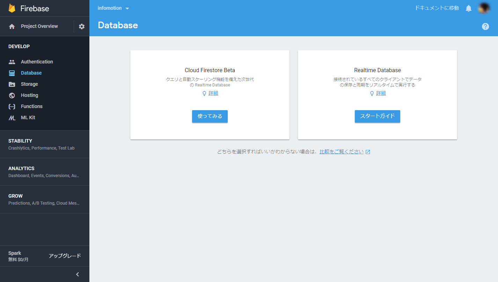
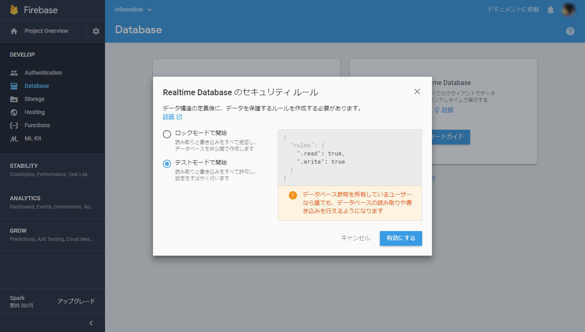

## Firebase アカウントの登録  {#Firebase アカウントの登録 }

https://firebase.google.com/ にアクセスし、アカウントを登録します。
firebase にログインし、 [プロジェクトを追加] をクリックしてください。

任意のプロジェクト名を入力し、国/地域 を選択後、[プロジェクトを作成] をクリックしてください。
新しいプロジェクトが作成されます。

プロジェクト画面が表示されます。
「ここから始めましょう。」 の下にある [ウェブアプリに Firebase を追加] をクリックしてください。

設定スクリプトのポップアップウィンドウが表示されます。後程使用するので、コピーして任意の場所に貼り付けておいてください。

## 認証 {#認証}

フローを作成する前に、アプリの認証の設定をする必要があります。
今回は、匿名の認証を用います。

プロジェクト左側のメニューから [Develop] をクリックして、さらに [Authentication] のページを開きます。
[ログイン方法を設定] をクリックします。

[匿名] を選択します。

スイッチを on にして [保存] をクリックします。

匿名が有効になっているのを確認してください。

## DataBase のセットアップ  {#DataBase のセットアップ }

次に左部のメニューから [Database] をクリックしてください。
Realtime Databaseの [スタートガイド] をクリックします。

[テストモードで開始] を選択し、[有効にする] をクリックします。

