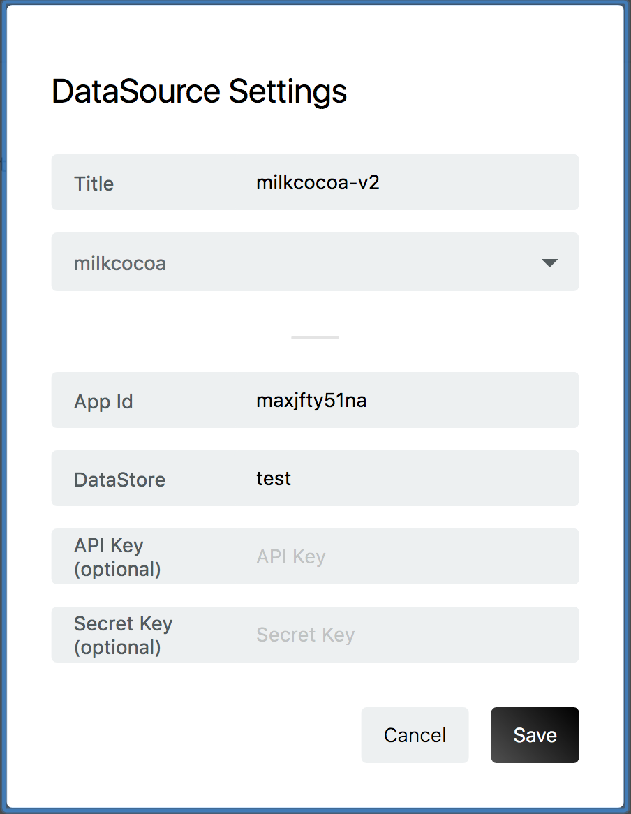

## Data Source の作成

フローを作成したものと同じプロジェクトの `Data Source` のページを表示します。
右下の + ボタンをクリックして、 `Data Source`を追加します。

`Title` に任意の名前を入力し、DataSource Type から [milkcocoa] を選択してください。
milkcocoa 用の設定画面が開きます。

設定項目を入力し [Save]を押すことで保存されます。
各設定項目については下記を参照してください。

※ milkcocoa アプリの設定で API認証を有効にした場合は`API Key` と `API Secret` の入力が必要となります。

## 各設定項目の確認

milkcocoa の `AppId` は App画面のトップより確認できます。

DataStoreは、フローで入力し作成したもの、あるいはこれから作成するもの入力します。
[CreateFlow](./CreateFlow.md) で作成したフローでは、[test] と設定しています。

`API Key` と `API Secret` は認証のページから確認できます。

## InfoMotionの作成

DataSource を使用する準備ができました。
InfoMotion ダッシュボードを作成する際に作った DataSource を選択することでデータをグラフに反映できます。

詳しくは以下のページを順に参照してください。

* [Sample infotypes](./../../SampleInfoTypes.md)
* [Upload an InfoType](./../../UploadInfoType.md)
* [Create nfoMotion](./../../CreateInfoMotion.md)