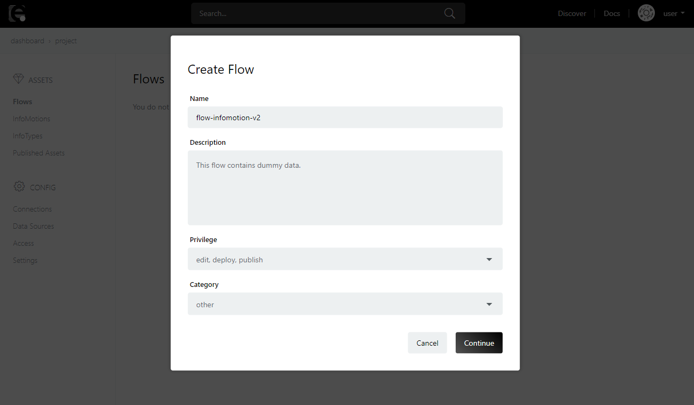
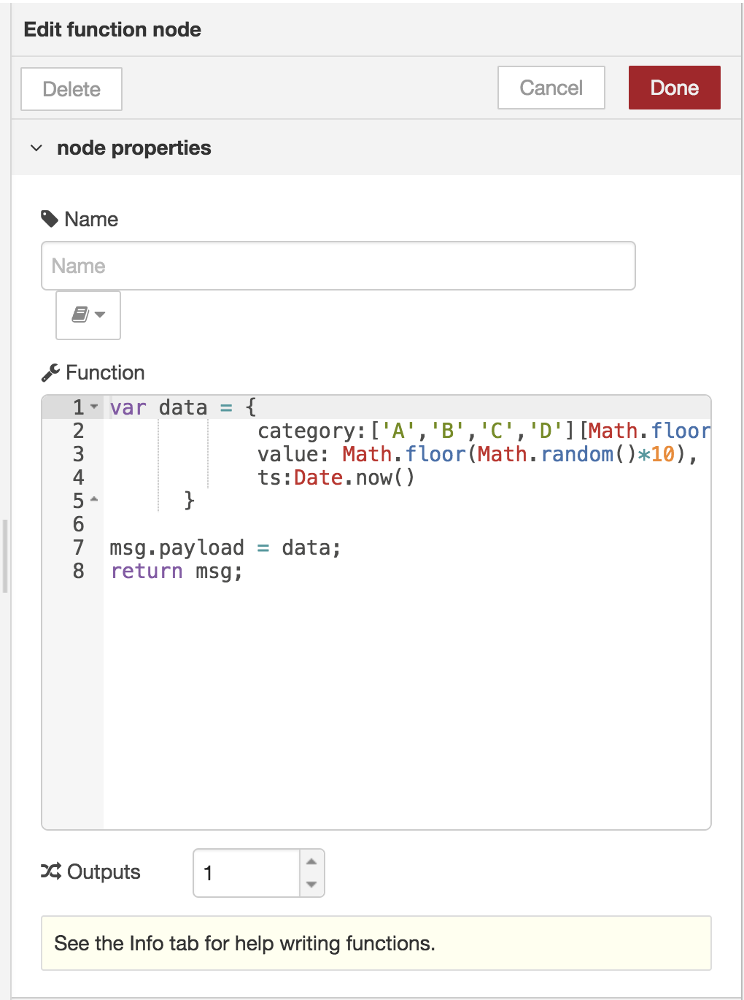
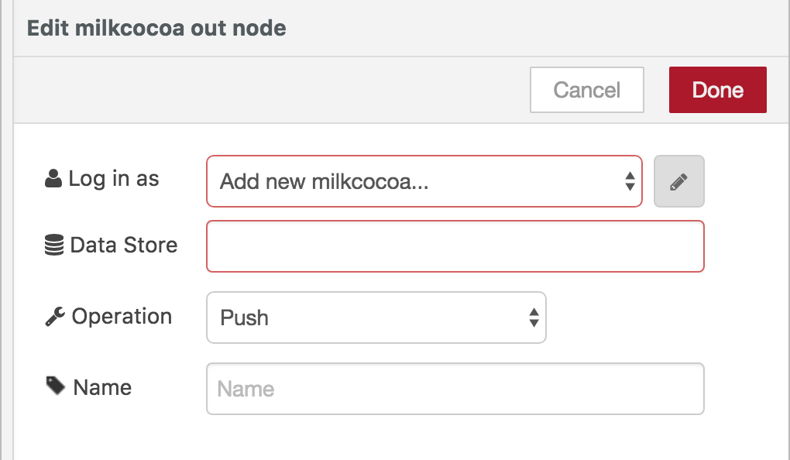
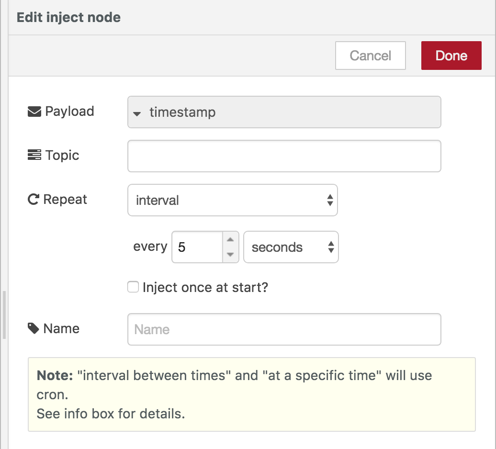
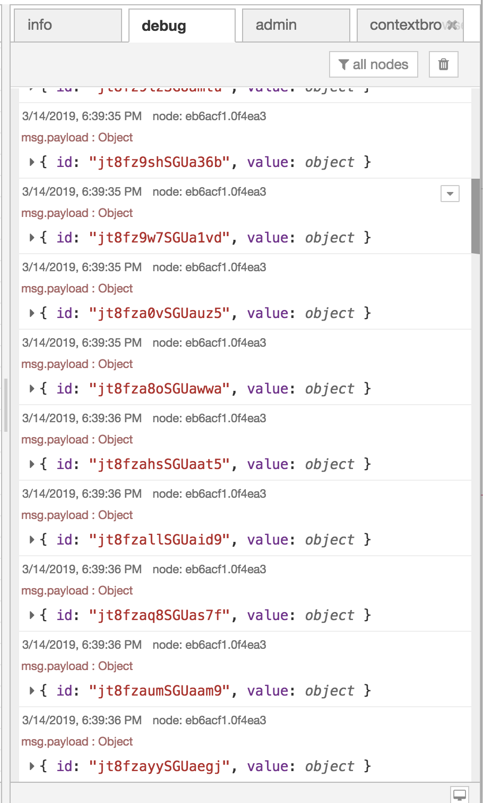
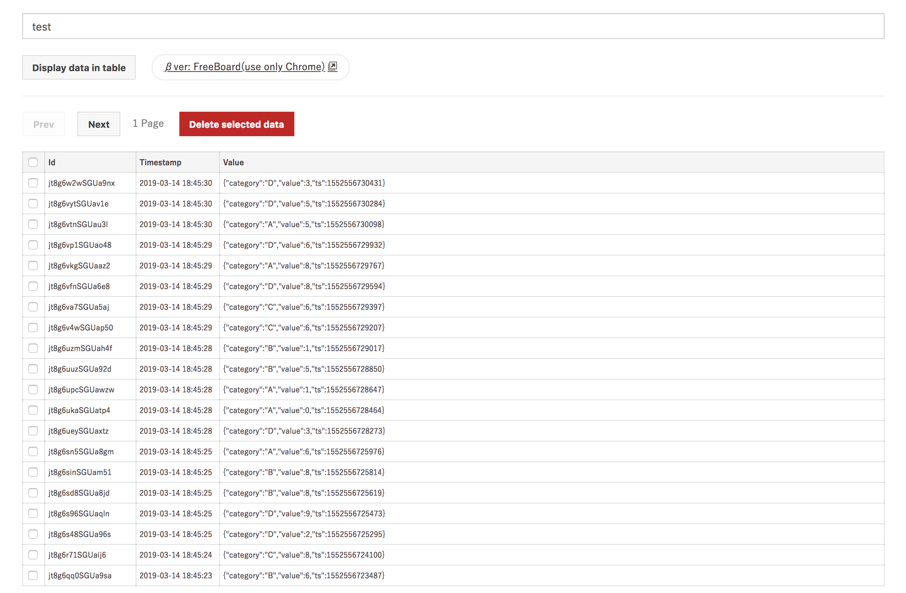

## フローの作成

milkcocoa Datastore にデータをプッシュするフローの作成例について説明します。

enebular のプロジェクトから新しいフローを作成してください。




[Edit Flow] をクリックして、フローエディタ―を開きます。
下記のノードを配置し、下記の画像のようなフローを作成してください。

* inject ノード
* function ノード
* milkcocoa(output) ノード
* debug ノード


function ノードをダブルクリックして `edit function node` のモーダル画面を表示してください。
下記スクリプトをコピーして Function に貼り付けます。

```javascript
var data = {
  country: ['JP', 'USA', 'CN'][Math.floor(Math.random() * 3)],
  value: Math.floor(Math.random() * 10),
  created: Date.now()
}

msg.payload = data
return msg
```

入力出来たら、 [Done] をクリックして画面を閉じます。




次に milkcocoa ノードのモーダル画面を表示します。




鉛筆のアイコンをクリックして、`Add new milkcocoa config node` のモーダル画面を表示します。
`App ID` には先ほど作成した milkcocoa アプリの `app_id` を入力します。
`API Key` と `API Secret` は空のままにし、[Add] をクリックしてください。

※ milkcocoa アプリの設定で API認証を有効にした場合は`API Key` と `API Secret` の入力が必要となります。


`Data Store` には 「test」 を入力し、 `operation` は [Push] を選択します。
設定が終わったら [Done] をクリックして、モーダル画面を閉じます。


次に inject ノード(表示は timestamp )のモーダル画面を表示します。

 `repeat` を [interval] とし、every [5] seconds に設定します。
 [Done] をクリックして、モーダル画面を閉じます。




全てのノードの準備ができたので、 [Deploy] を押してノードを実行します。

フローの実行ログをエディター右部のデバッグタブより閲覧できます。
下記のようなログが表示され、正しくフローが実行されていることを確認してください。




次に milkcocoa のページで先ほど作ったアプリからデータにデータが追加されているか確認します。

[データストア] ページを表示し、検索バーに "test" を入力してください。
[リスト表示（更新）] をクリックしてデータストアのリストを表示します。
下記のようにデータが追加されていることを確認してください。


