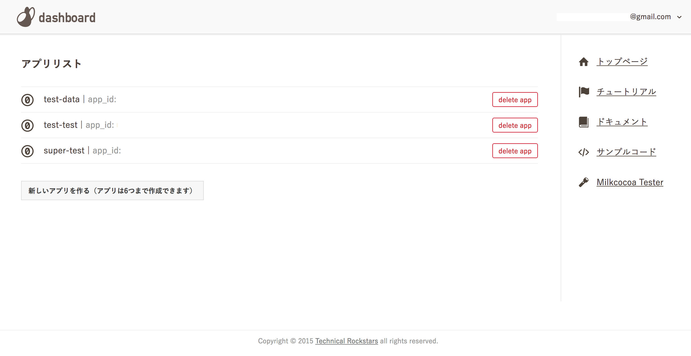
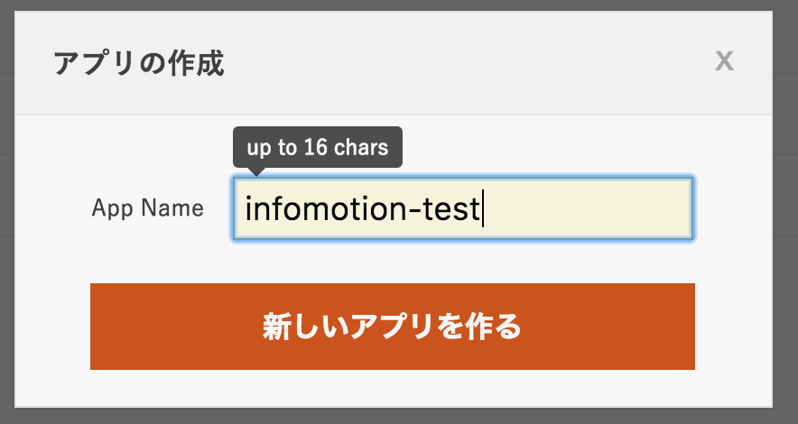
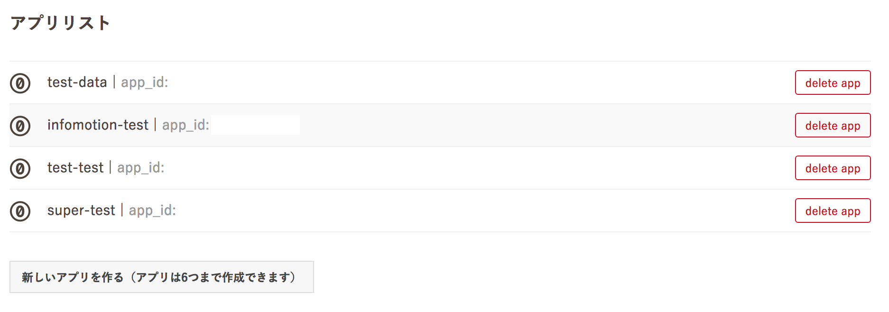
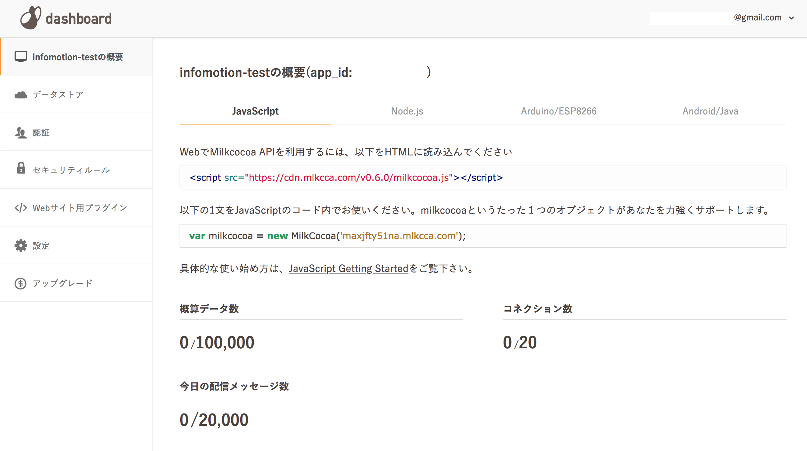

## milkcocoa アカウントの登録

https://mlkcca.com/ にアクセスし、アカウントを登録します。
milkcocoaにログインし、ダッシュボードの [新しいアプリを作る] をクリックしてください。

アプリに名前を付けます。

リストに新しいアプリが追加されます。

アプリには固有の `app_id` が紐づきます。
初期設定でアプリの認証が public となっています。

