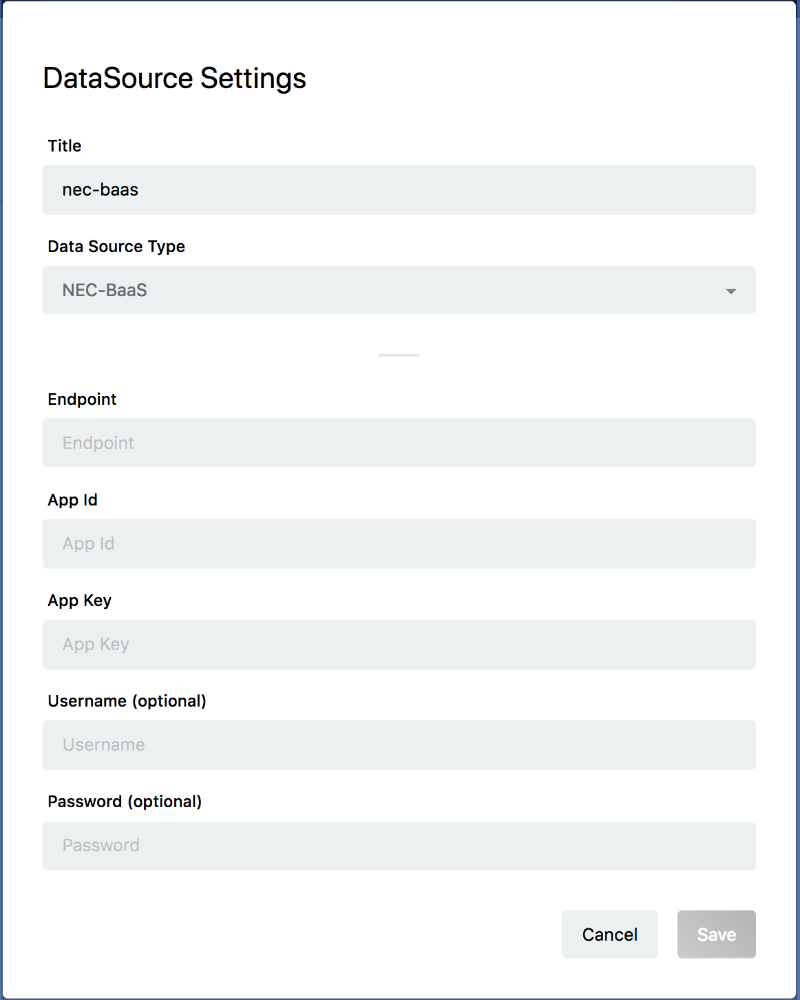

# NEC BaaS Data Source の作成 {#Create NEC-BaaS Data Source}

※ InfoMotionのライブモードは使用できません

NEC BaaSは「NEC モバイルバックエンド基盤」です。詳しくは[こちらのページ](https://nec-baas.github.io/index.html)を参照してください。

NEC BaaSのInfoMotion対応については、[こちらのページ](https://github.com/nec-baas/baas-infomotion)を参照してください。

Project のダッシュボードの左メニューの `Data Sources` をクリックし、右下のプラスボタンをクリックして新規 Data Source を作成してください。

以下の情報を入力してください。

* Title
  * Data Sourceの名前を入力してください。
* Data Source Type
  * NEC-BaaSを選択してください。
* Endpoint
	* `https://{APIサーバホスト名}/api/1/{テナント名}/api/infomotion/search/{バケット名}?{検索条件}`
	    * APIサーバホスト名は、ご利用中のNEC BaaSの稼働するサーバホスト名を指定してください。
	    * テナント名(ID)は NEC BaaS のデベロッパーコンソール上で確認してください。
      * バケット名は参照するオブジェクトバケット名を指定してください。
      * 検索条件の設定は任意となります。オブジェクトクエリの検索条件と同フォーマットで where が指定できます。検索条件については、[NEC BaaSのドキュメント](https://nec-baas.github.io/documents.html)をご確認ください。
* App Id
	* NEC BaaSのアプリケーションIDを指定します。NEC BaaSのデベロッパーコンソール上で確認してください。
* App Key
	* NEC BaaSのアプリケーションキーを指定します。NEC BaaSのデベロッパーコンソール上で確認してください。
* Username (optional)
	* NEC BaaSに登録済みのユーザ名を指定します。Basic 認証を行わない場合は、指定不要です。
* Password (optional)
	* NEC BaaSに登録済みのユーザのパスワードを指定します。Basic 認証を行わない場合は、指定不要です。

各項目の入力が終わったら Save を押して、Data Sourceを保存します。

新しくNEC BaaSのData Sourceが作成されていることを確認してください。

## InfoMotionの作成 {#Create InfoMotion}

Data Source を使用する準備ができました。
InfoMotion ダッシュボードを作成する際に作った Data Source を選択することでデータをグラフに反映できます。

詳しくは以下のページを順に参照してください。

* [Sample InfoTypes](./../../SampleInfoTypes.md)
* [Upload an InfoType](./../../UploadInfoType.md)
* [Create InfoMotion](./../../CreateInfoMotion.md)
