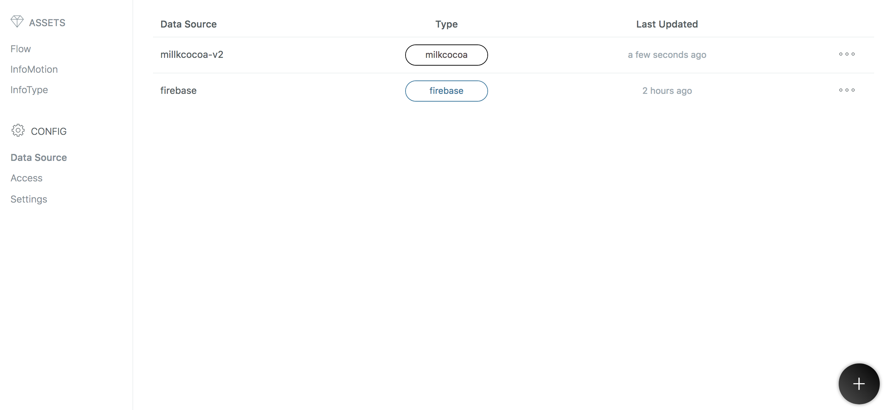
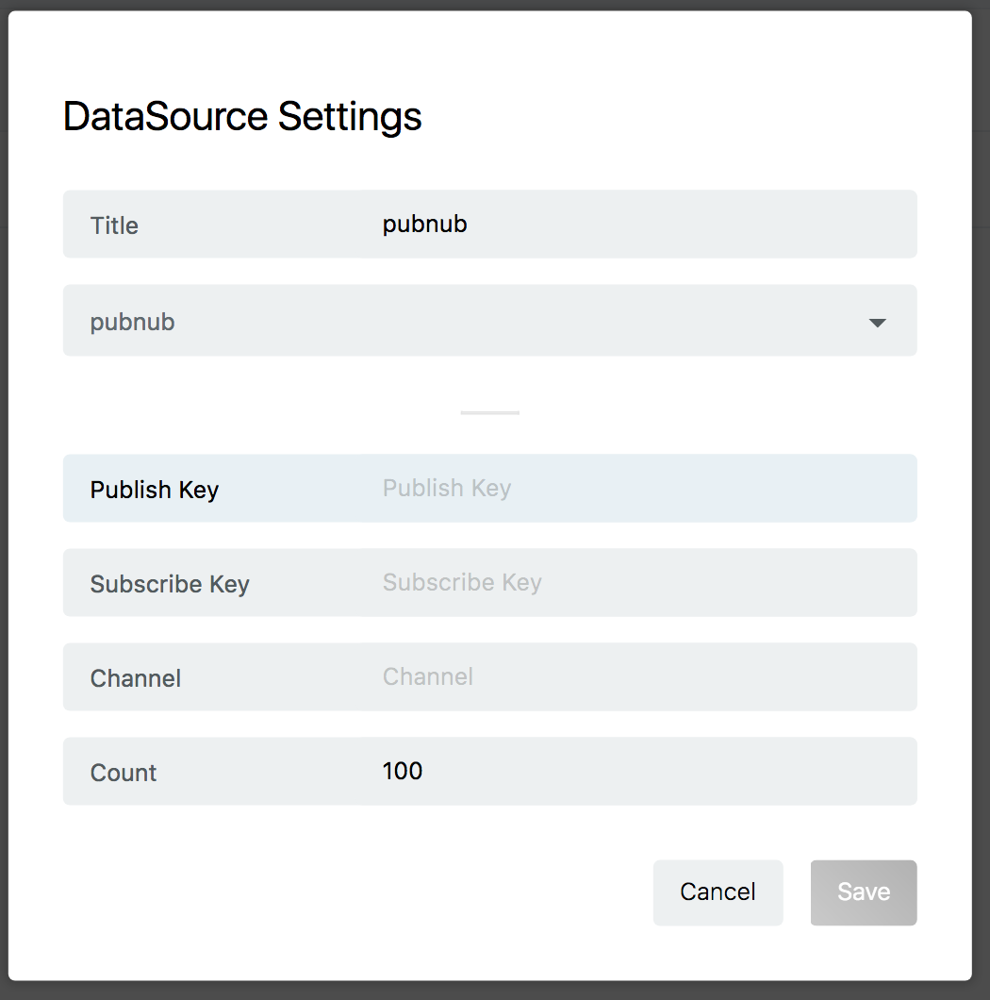
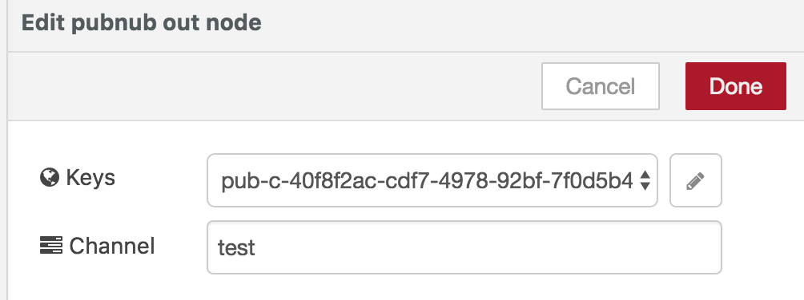

## DataSource の作成

フローを作成したものと同じプロジェクトの `Data Source` のページを表示します。
右下の + ボタンをクリックして、 `Data Source`を追加します。

`Title` に任意の名前を入力し、DataSource Type から [pubnub] を選択してください。
pubnub 用の設定画面が開きます。

`Count` は [100] のままに設定して、他、設定項目を入力し [Save]を押すことで保存されます。
各設定項目については下記を参照してください。

## 設定項目の確認

`Publish key`, `Subscribe key`  は pubnub アプリの keys から確認できます。

`channel` にはフローでに設定したものを入力します。

## InfoMotionの作成

DataSource を使用する準備ができました。
InfoMotion ダッシュボードを作成する際に作った DataSource を選択することでデータをグラフに反映できます。
詳しくは以下のページを順に参照してください。

* [Sample infotypes](./SampleInfoTypes.md)
* [Upload an InfoType](./UploadInfoType.md)
* [Create InfoMotion](./CreateInfoMotion.md)
