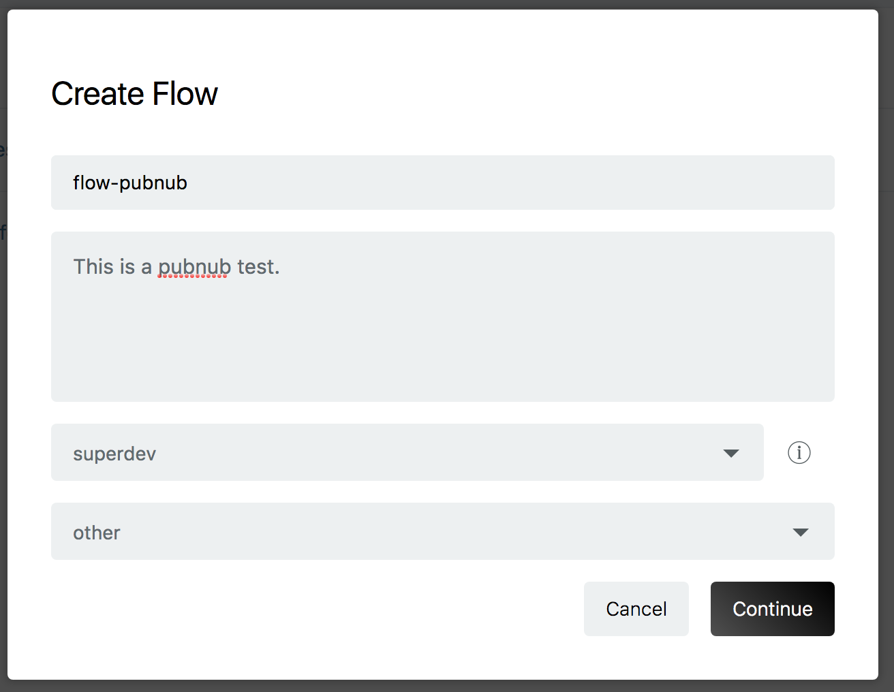
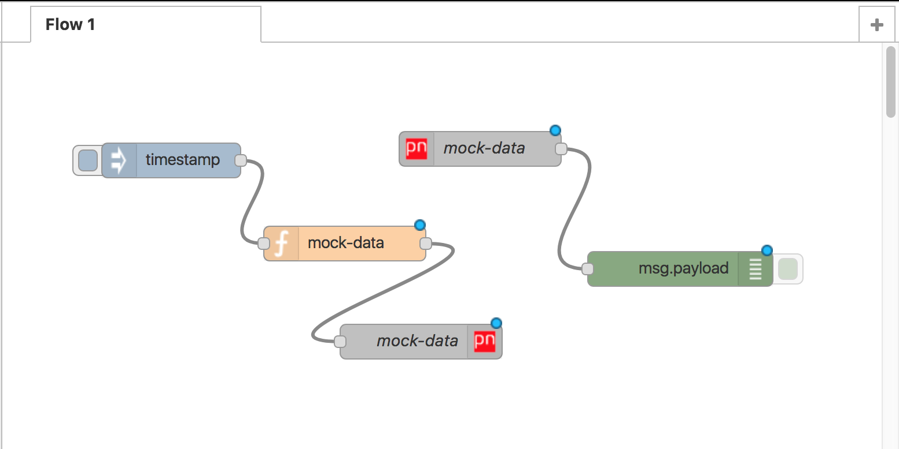
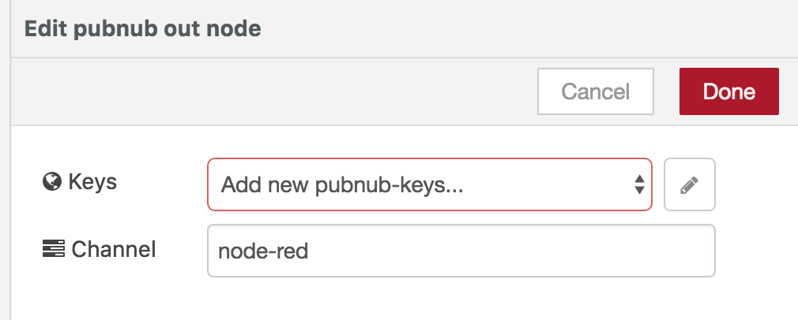
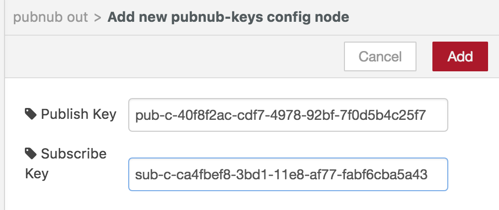
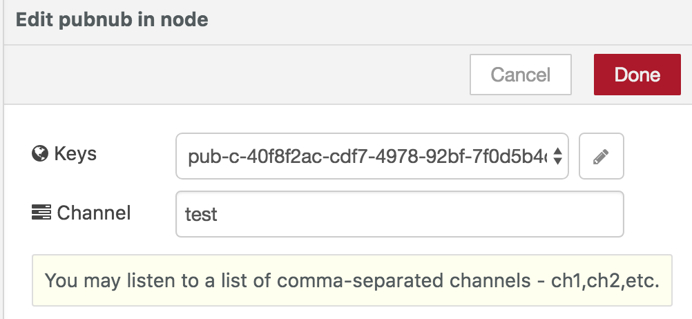
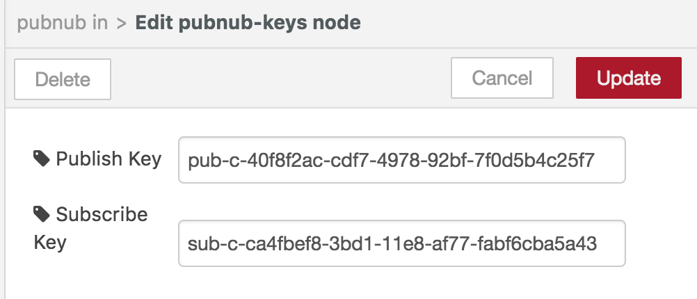
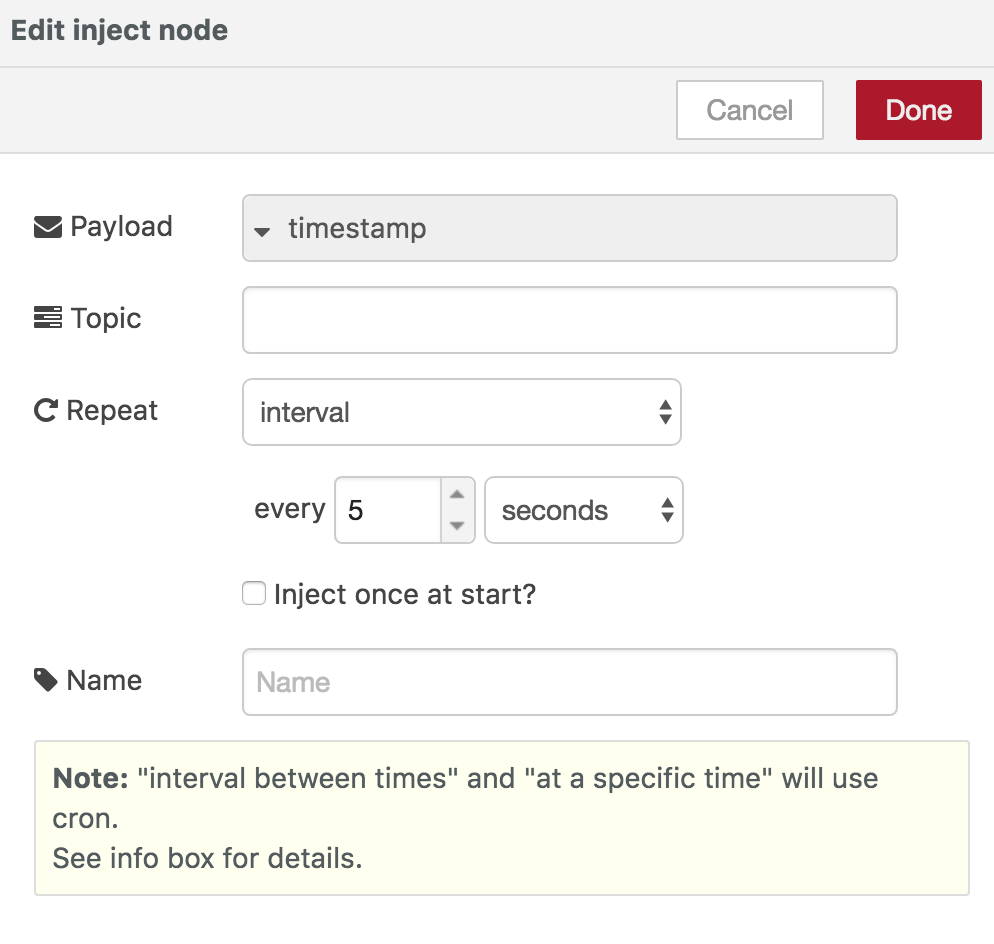
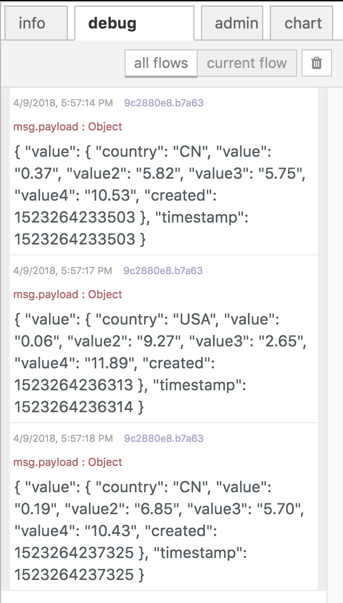

## フローの作成

Pubnub datastore にデータをプッシュするフローの作成例について説明します。 

enebular のプロジェクトから新しいフローを作成してください。




[Edit Flow] をクリックして、フローエディタ―を開きます。




下記のノードを配置し、下記の画像のようなフローを作成してください。

* inject ノード
* function ノード
* pubnub(in) ノード
* pubnub(out) ノード
* debug ノード


function ノードをダブルクリックして `edit function node` のモーダル画面を表示してください。
下記スクリプトをコピーして Function に貼り付けます。

```javascript
var data = {
	ts:Date.now(),
	category:['A','B','C','D'][Math.floor(Math.random()*4)],
    value: Math.floor(Math.random()*10)
}

msg.payload = data; 
return msg;
```

入力出来たら、 [Done] をクリックして画面を閉じます。


pubnub out ノードをダブルクリックしてモーダル画面を表示します。
鉛筆のアイコンをクリックしてください。




`Add new pubnub-keys config node` のモーダル画面を表示します。
先ほど作成した pubnub アプリの `Publish key` と `Subscribe key` を入力してください。
[Done] をクリックして設定を保存します。




`channel` には仮に 「test」 とします。この channel にデータをプッシュします。
[Done] をクリックして画面を閉じます。


pubnub in ノードにも同じ key, channel の設定をします。




鉛筆のアイコンをクリックして、各設定を入力してください。




次に inject ノード(表示は timestamp )のモーダル画面を表示します。

 `repeat` を [interval] とし、every [5] seconds に設定します。
 [Done] をクリックして、モーダル画面を閉じます。




全てのノードの準備ができたので、 [Deploy] を押してノードを実行します。

フローの実行ログをエディター右部のデバッグタブより閲覧できます。
下記のようなログが表示され、正しくフローが実行されていることを確認してください。


