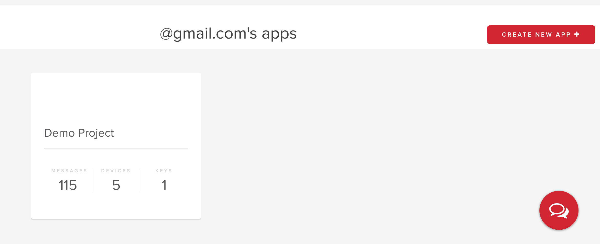
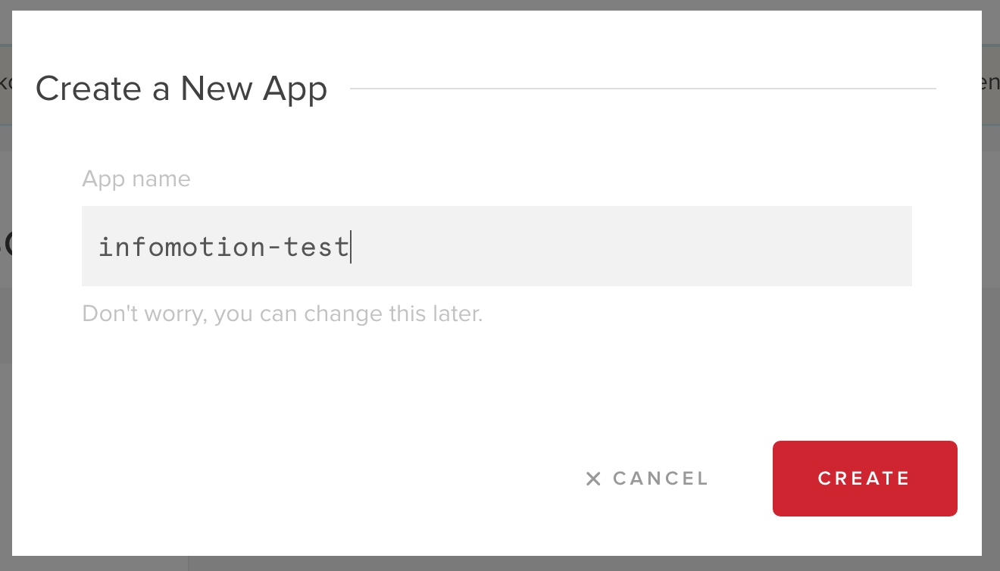
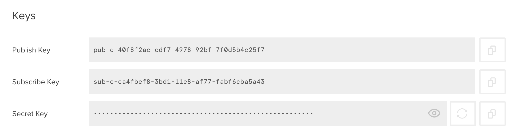

## Pubnub アカウントの準備

https://www.pubnub.com/ にアクセスし、アカウントを登録します。
Pubnub にログインし、ダッシュボード右上の [CREATE NEW APP +] をクリックしてください。 

任意の名前を付けて、アプリを作成します。

リストに新しいアプリが追加されます。

作成したアプリをクリックします。

Pubnub は初期設定から Demo Keyset を提供しています。
これらの Key はデータストアにデータをプッシュするのに必要となります。
Demo Keyset をクリックして表示してください。

InfoMotion で データを表示するには、Pubnub にデータをプッシュした際にデータを保存する必要があります。
`STORAGE & PLAYBACK` の項目までスクロールダウンしてください。
スイッチを on の方に切り替え、`Retention` を 1 day 以上に設定してください。
[save changes] をクリックして設定を保存します。

