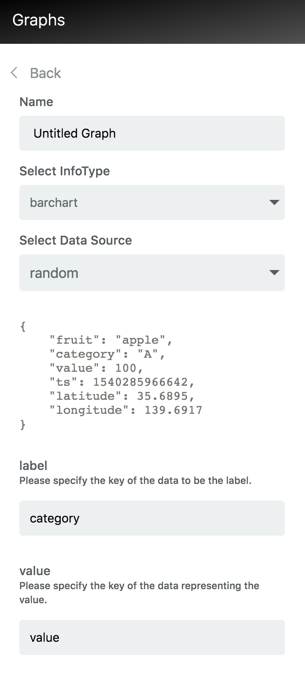

# Random Data Generator 

Random Datasourceでは、クライアント側で生成されたランダムデータを使って InfoType のテストをすることが出来ます。  
データを作成をせずにダッシュボード上で InfoType の確認ができるため便利です。

## Set-up

Random adapter はセットアップなしで利用できます。  
InfoMotionのダッシュボードでグラフの作成時に、Data Sourceのプルダウンに `random` という項目があるので選択します。



## Random Sample Data 

```javascript
{
    "fruit": "apple",
    "category": "A",
    "value": 100,
    "created": 1540285966642,
    "latitude": 35.6895,
    "longitude": 139.6917
}
```

## Random Data Schema

```json
{
  "type": "object",
  "title": "The Root Schema",
  "required": [
    "fruit",
    "category",
    "value",
    "created",
    "latitude",
    "longitude"
  ],
  "properties": {
    "fruit": {
      "$id": "#/properties/fruit",
      "type": "string",
      "title": "The Fruit Schema",
      "examples": [
        "apple"
      ],
      "pattern": "^(.*)$"
    },
    "category": {
      "$id": "#/properties/category",
      "type": "string",
      "title": "The Category Schema",
      "examples": [
        "A","B","C"
      ],
      "pattern": "^(.*)$"
    },
    "value": {
      "$id": "#/properties/value",
      "type": "integer",
      "title": "The Value Schema",
      "examples": [
        100
      ]
    },
    "created": {
      "$id": "#/properties/created",
      "type": "integer",
      "title": "The Created Schema",
      "examples": [
        1540285966642
      ]
    },
    "latitude": {
      "$id": "#/properties/latitude",
      "type": "number",
      "title": "The Latitude Schema",
      "examples": [
        35.6895
      ]
    },
    "longitude": {
      "$id": "#/properties/longitude",
      "type": "number",
      "title": "The Longitude Schema",
      "examples": [
        139.6917
      ]
    }
  }
}
```