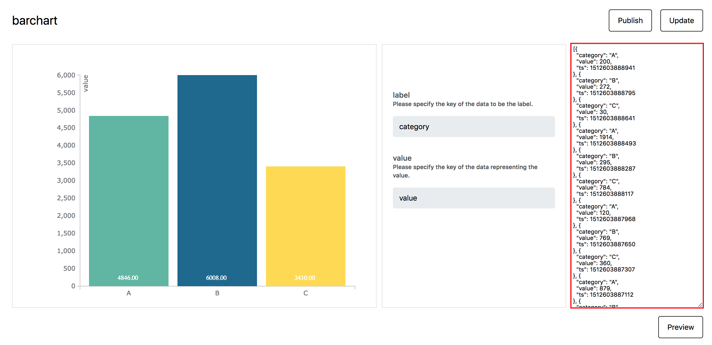

# Data Source Schema

すべてのデータソースのデータは、下記のスキーマに示すように Unix タイムスタンプ値を含む `ts` キーを持つ必要があります。
`ts` の値は、daterange picker や timeline によりビジュアライズするデータ範囲を特定する際に InfoMotion で利用されます。
また、このデータは InfoType に渡され、graph や chart を描画するときにも利用することがあります。

```javascript
{
  ts: Unix Timestamp milliseconds since Jan 01 1970. (UTC), // timestamp for daterange, timeline and querying.
  // All data in this object is passed to the infotype
}
```

#InfoType サンプルデータ

InfoType 毎に、データに特定のキーと値が含まれることが必要となります。
InfoType に応じて必要となるキーと値を知るには、InfoType のプレビューの右側に表示されるサンプルデータが役に立ちます。



上記に示すように、enebular の sample barchart では、以下のキーと値を必要とします。

```javascript
{
  ts: Unix Timestamp milliseconds since Jan 01 1970. (UTC),
  category: String,
  value: Number
}
```

## JSON Data Schema

```json
{
  "type": "object",
  "required": ["timestamp", "value"],
  "properties": {
    "timestamp": {
      "$id": "#/properties/timestamp",
      "type": "integer",
      "title": "The Timestamp Schema",
      "examples": [1542352981750]
    },
    "value": {
      "$id": "#/properties/value",
      "type": "object",
      "title": "The Value Schema"
    }
  }
}
```

```

```
