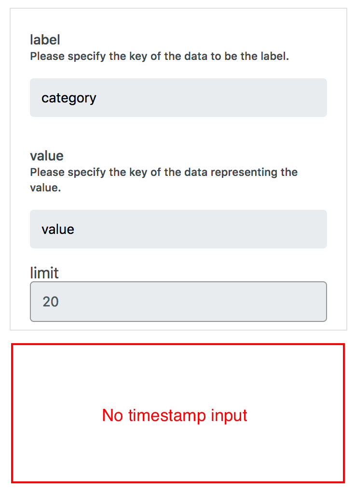

# Data Source Schema {#Data Source Schema}

すべてのデータソースのデータは、下記のスキーマに示すように Unix タイムスタンプ値を含む `ts` キーを持つ必要があります。
`ts` の値は、daterange picker や timeline によりビジュアライズするデータ範囲を特定する際に InfoMotion で利用されます。
また、このデータは InfoType に渡され、graph や chart を描画するときにも利用することがあります。

```json
{
  "ts": Unix Timestamp milliseconds since Jan 01 1970. (UTC), // timestamp for daterange, timeline and querying.
  // All data in this object is passed to the infotype
}
```

#InfoType サンプルデータ {#InfoType サンプルデータ}

InfoType 毎に、データに特定のキーと値が含まれることが必要となります。
InfoType に応じて必要となるキーと値を知るには、InfoType のプレビューの右側に表示されるサンプルデータが役に立ちます。


上記に示すように、enebular の sample barchart では、以下のキーと値を必要とします。

```json
{
  "ts": Unix Timestamp milliseconds since Jan 01 1970. (UTC),
  "category": String,
  "value": Number
}
```

## JSON Data Schema {#JSON Data Schema}

```json
{
  "type": "object",
  "required": ["ts"],
  "properties": {
    "ts": {
      "type": "integer",
      "title": "The ts Schema",
      "examples": [1542352981750]
    }
  }
}
```

# 非推奨の Data Source Schema {#Deprecated Data Source Schema}

従来の Data Source Schema は以下でしたが、こちらは非推奨となりました(enebular バージョン 2.7.3 以降)。

```json
{
  "type": "object",
  "required": ["timestamp", "value"],
  "properties": {
    "created": {
      "type": "integer"
    },
    "value": {
      "type": "object",
      "required": [],
      "properties": {}
    }
  }
}
```

非推奨の Data Source Schema のサンプルデータを以下に示します。

```json
{
  "timestamp": 1549618349819,
  "value": {
    "created": 1549618349819,
    "category": "A",
    "value": 20
  }
}
```

## Dashboard の daterange picker や timeline を利用する際の注意点

`timestamp` と `ts` の両方のキーを含むデータを受信した場合、InfoMotion は `ts` に割り当てられた値を時刻として扱います。

## Official line chart を利用する際の注意点

この Data Source Schema の非推奨化に伴い、enebular の Official line chart の InfoType も非推奨となり、アップデートを行いました。

既に非推奨の Data Source Schema と非推奨の Official line chart を利用している場合はこれまで通り利用頂くことが可能です。

新しい Official line chart は、推奨 / 非推奨のどちらの Data Source Schema であっても利用することができます。

既に非推奨の Official line chart を利用されている場合で、新しい Data Source Schema に切り替える場合は、`Discover` から新しい Official line chart をインポートし直す必要があります。

ご利用頂いている Official line chart が非推奨であるかどうかについては、 line chart グラフの設定を行うサイドバー に timestamp 設定欄が存在するかどうかにより確認できます。

**新しい Official line chart の場合**

timestamp 入力欄が存在します。


**非推奨の Official line chart の場合**

timestamp 入力欄が存在しません。



**InfoType を作成している場合の注意点**

非推奨の Official line chart では `created` キーに割り当てられた時刻を利用していますが、もし同様に `created` を利用した InfoType を開発し、 Publish されている場合には推奨 Data Source Schema に含まれる `ts` を利用するように修正することを推奨致します。
