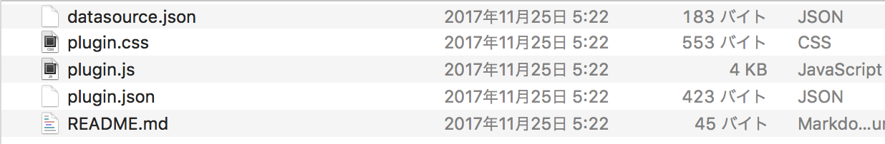
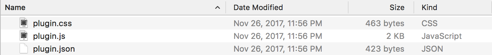

# InfoMotion Tool

InfoType を作成するには `infomotion-tool` が必要です。

[Sample InfoTypes](./SampleInfoTypes.md) でサンプルの InfoType を使用する準備することができます。

`infomotion-tool` を使ってローカル環境で編集とテストができます。完成した InfoType はパッケージにして enebular にアップロードすることができます。

## infomotion-tool のインストール

```
npm install @uhuru/enebular-infomotion-tool-v2 -g
```

InfoMotion-tool には `nodejs >= 6 and npm 5.2+` が必要です。

permission error が起こった際には、以下のいずれかで解決ができることがあります。

1) 現在のユーザーに `/usr/local/lib/` 内の `node_modules` に権限を与えます。権限を与えたのち、再度グローバルインストールください。

- MacOSX: https://support.apple.com/kb/PH25287?locale=en_US 
- Windows: https://docs.microsoft.com/en-us/previous-versions/windows/it-pro/windows-server-2008-R2-and-2008/cc754344(v=ws.11) 

2) NVM を利用する**（推奨）**

- MacOSX: https://github.com/creationix/nvm  
- Windows: https://github.com/coreybutler/nvm-windows 

3) npm の[デフォルトのディレクトリ](https://docs.npmjs.com/getting-started/fixing-npm-permissions)を変更する。

## 利用可能なコマンド

```
eit create [graph name]  = Creates an InfoType with the [graph name] 
eit run [graph name]     = Runs [graph name] on localhost:3000 
eit run [graph name] -l  = Runs livereload [graph name] on localhost:3000 
eit package [graph name] = Creates files to upload on enebular
eit help                 = help
```

## グラフの作成

以下のコマンドから始めます。

```
eit create myfirstgraph
```

以下のファイルが作成されます。

- `datasource.json`
- `plugin.css`
- `plugin.js`
- `plugin.json`
- `README.md`



### datasource.json

*このファイルはテスト用途です。*

ブラウザでテストする際に利用する DataSource の指定ができます。

`adaptor` に DataSource の種類を指定します。具体的には以下があります。

- `milkcocoa`
- `pubnnub`
- `apigateway`
- `random`
- `mock`


具体的には以下のように指定します。

#### Milkcocoa adaptor

[Milkcocoa](https://mlkcca.com) のデータを使います。いくつかの値を自分のアプリのもので置き換えてください。

```json
{
  "adaptor": "milkcocoa",
  "apikey": "YOUR_API_KEY",
  "apisecret": "YOUR_API_SECRET",
  "appId": "YOUR_APP_ID",
  "dataStore": "YOUR_DATASTORE",
  "id": "milkcocoa",
  "title": "milkcocoa",
  "name": "milkcocoa"
}
* API Key, API Secret がない場合は空にします。
```

#### Pubnub adaptor

[Pubnub](https://pubnub.com) のデータを使います。いくつかの値を自分のアプリのもので置き換えてください。

```json
{
  "adaptor": "pubnub",
  "pubnub": {
    "publishKey": "YOUR_PUBLISH_KEY",
    "subscribeKey": "YOUR_SUBSCRIBE_KEY",
    "ssl": true,
  },
  "chanel" : "YOUR_CHANNEL",
  "count" : 100
  "appId": "pubnub",
  "id": "pubnub",
  "title": "pubnub",
  "name": "pubnub"
}
```

### API Gateway Adaptor

[AWS API Gateway](https://aws.amazon.com/) をエンドポイントとしてデータを取得します。いくつかの値を自分のアプリのもので置き換えてください。

```json
{
  "apiKey": "YOUR_API_KEY",
  "endpoint": "YOUR_ENDPOINT",
  "id": "apigateway",
  "projectId": "YOUR_PROJECT_ID",
  "title": "apigateway",
  "adaptor": "apigateway"
}
```

#### Random adaptor

ランダムに生成されるデータを使います。

```json
{
  "adaptor": "random",
  "id": "random",
  "title": "random",
  "name": "random"
}
```

データは以下のようなスキームになります。

```javascript
{
  country: String,
  value: Number
}
```

#### Mock Adaptor

素早くテストするために、自分で書いたデータを使うことができます。データ数が少ない場合、同じデータが繰り返して補完されます。


```json
{
  "adaptor": "mock",
  "id": "mock",
  "title": "mock",
  "name": "mock"
  "data": [{"id": "a", "value": 1}, {"id": "b", "value": 21}, {"id": "c", "value": 512}]
}
```

### plugin.css

グラフで利用する CSS です。グローバルに指定されるので、衝突しないように命名に注意してください。

### plugin.js

グラフの主なロジックが入った、メインとなるファイルです。

デフォルトで D3.js がグローバルにインストールされています。詳しくは [API Reference](./APIReference.md) をご覧ください。

### plugin.json

グラフを enebular にアップロードした際のプレビューのために必要なファイルです。

`sampleSettings` はデフォルトのスキーマ設定、`sampleData` はサンプルデータです。

```json
{
  "defaultSettings": {
    "label" : "country",
    "value": "v"
  },
  "sampleData": [
    {
      "country": "JP",
      "v": 1
    },
    {
      "country": "CN",
      "v": 2
    }
  ]
}
```

## テンプレート

デフォルトで作成されるグラフはデータをそのまま表示する `DataLogger` です。

以下に、利用可能なテンプレートを示します。

```
eit create [graph name] -t barchart
eit create [graph name] -t linechart
eit create [graph name] -t piechart
eit create [graph name] -t map
```

# InfoType の依存性

グラフはそれぞれの依存性を持ちます。グラフのインストールをする際は `npm install` を使います。`npm install` が完了すると、グラフをパッケージングして実行することができます。

```bash
cd [graph name]
npm install
Check the InfoTypes read.me for more details.
```

## パッケージング

以下の場合にパッケージングが必要になります。
- 新しく `eit create`  で InfoType を作成したとき
- enebular に InfoType をアップロードするとき

以下でパッケージできます。

```bash
eit package [graph name]
```

以下の3つが入った `target` というフォルダが作成されます。

- `plugin.js`
- `plugin.css`
- `plugin.json`

## ブラウザでのテスト

以下のコマンドで http://localhost:3000 にアクセスすることで、テストできます。テスト前にはパッケージしてください。

```
eit run [graph name]
```


`-l` オプションをつけることでライブリロードモードが利用できます。サーバーを立ち上げた状態でファイルを変更すると、すぐに反映されます。

```
eit run [graph name] -l
```



次に、[Upload InfoType](./UploadInfoType.md) で enebular へのグラフのアップロード方法を学びましょう。
