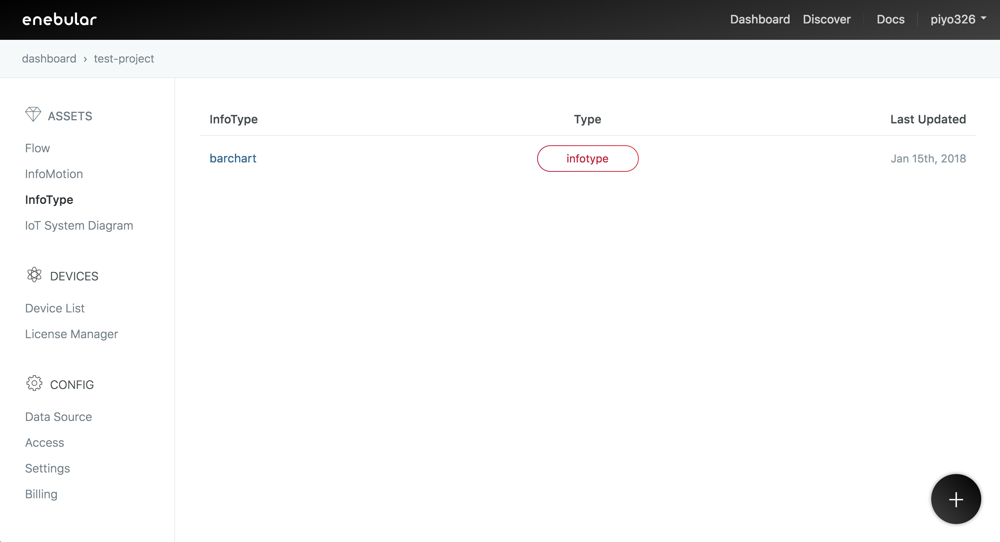
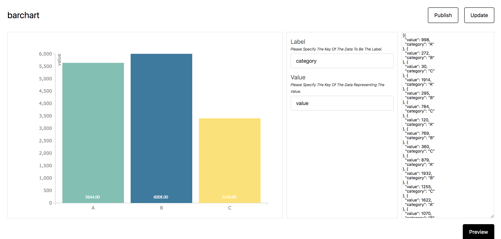
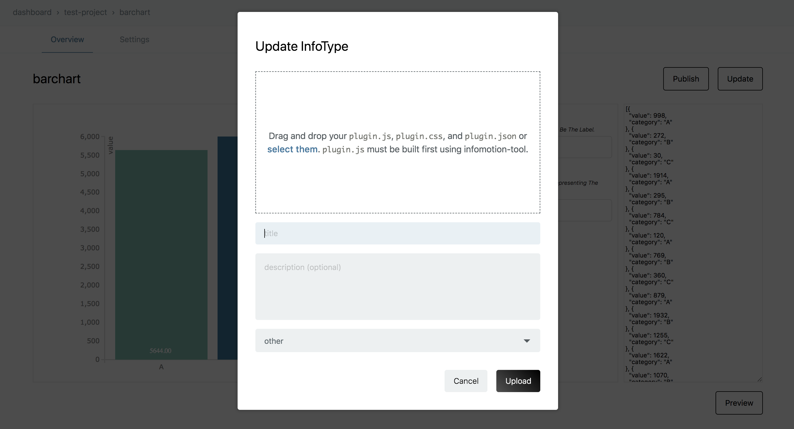
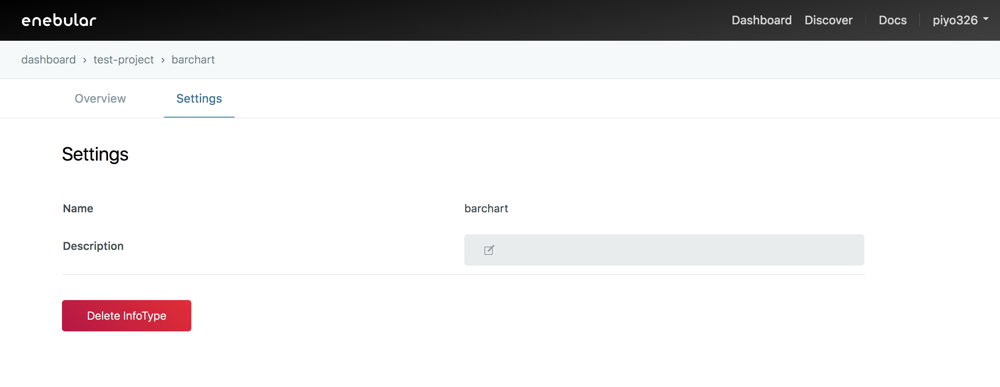

# InfoType {#InfoType}

InfoType とは InfoMotion で利用するグラフのタイプのことです。

以下に、デフォルトのグラフの例を示します。

```javascript
// 以下のようなデータが複数個あるとします
{
  created: Number,
  category: String,
  value:Number
}
```

- Bar Chart


- Line Chart


- Pie Chart


- [InfoType の作成方法はこちら](./InfoMotionTool.md)
- [作成した InfoType を enebular へアップロードする方法はこちら](./UploadInfoType.md)

InfoType をアップロードすると、enebular 上で確認できます。



InfoType を選択すると InfoType の詳細画面へ移動します。

## Overview {#Overview}

Overview ではグラフのプレビューができます。左からグラフ、スキーマ設定、データになります。スキーマとデータを変更して Preview を押すとグラフプレビューを更新できます。



右上の Update から InfoType のファイルが更新ができます。



## Settings {#Settings}

Settings では InfoType の名前の確認、説明の編集、InfoType の削除ができます。


