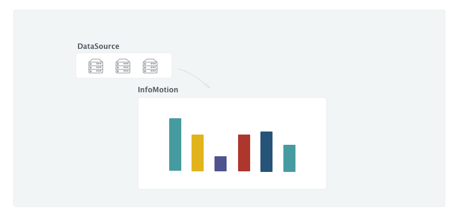
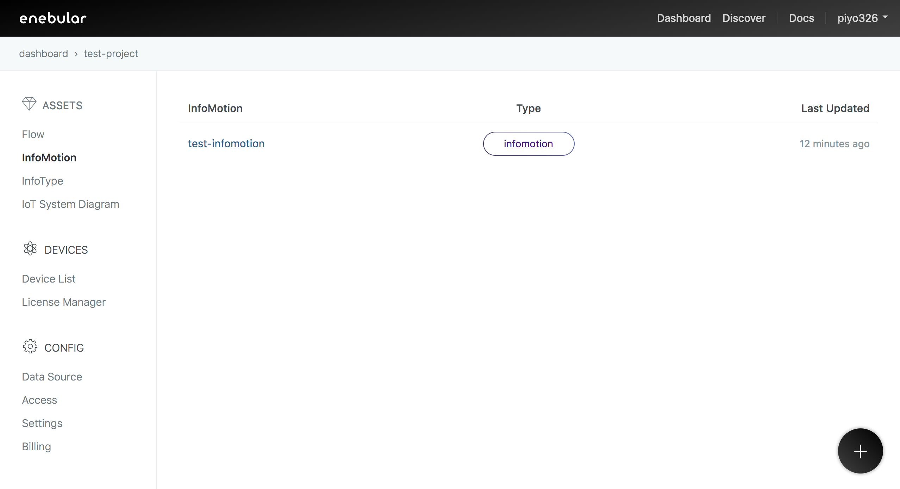
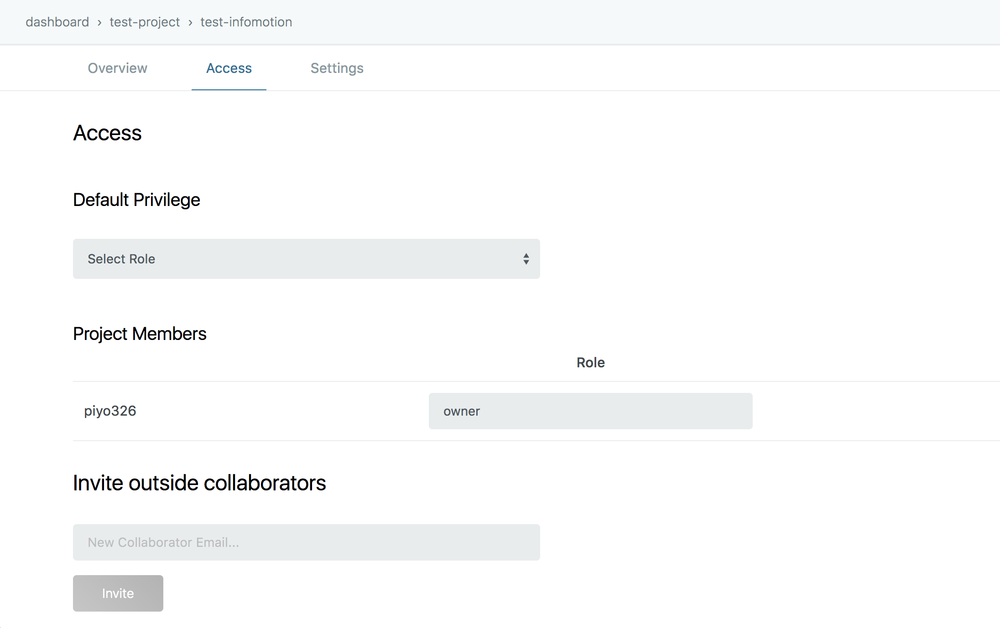
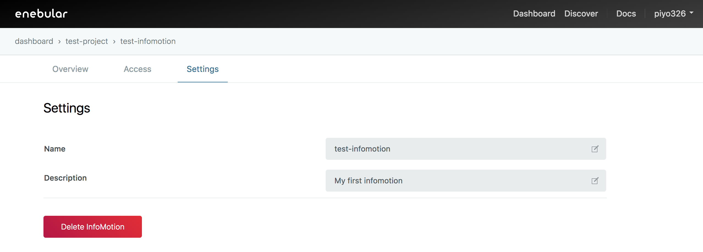

# InfoMotion について {#InfoMotion について}

`InfoMotion` は `DataSource` のデータを表示します。

デフォルトで用意されている単純なグラフに加えて、さらに複雑なグラフを購入、自作できます（[自作方法はこちら](./InfoMotionTool.md)）。

- [DataSource の作成方法はこちら](./CreateDataSource.md)
- [InfoMotion の作成方法はこちら](./CreateInfoMotion.md)

作成した InfoMotion は enebular 上で確認できます。

InfoMotion を選択すると InfoMotion の詳細画面へ移動します。

## Overview {#Overview}

InfoMotion ダッシュボードを表示します。詳しくは [Dashboard](./CreateInfoMotion.md) をご覧ください。

## Access {#Access}

Access では InfoMotion のアクセス権を編集できます。

詳しくは [Access Control](../Config/Access.md) をご覧ください。

## Settings {#Settings}

Settings では InfoMotion の名前や説明の編集、InfoMotion の削除ができます。

