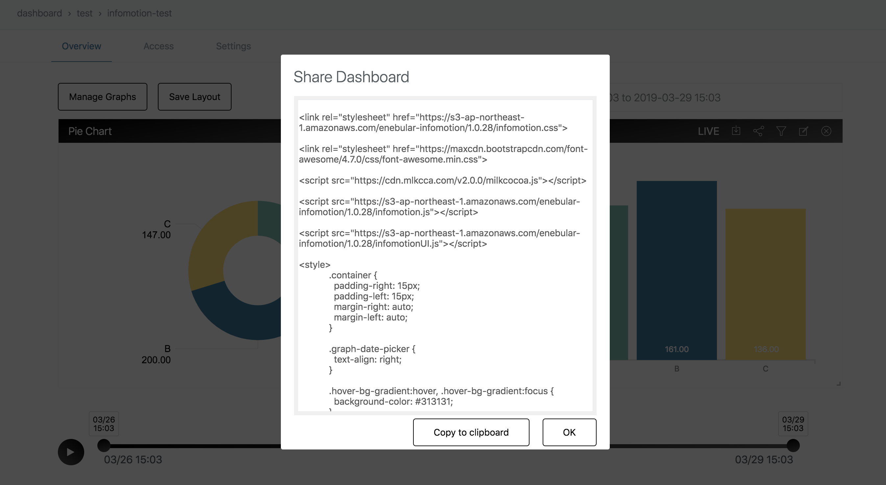

# InfoMotion の共有 {#Share InfoMotion}

InfoMotionのダッシュボードを別のアプリケーションやビューで利用したい場合、InfoMotionの共有機能を利用することで実現できます。

共有機能を実行するとInfoMotionはHTMLを表示しますので、これを別のアプリケーションやビューに埋め込むことにより、そこからInfoMotionのダッシュボードを利用できるようになります。

共有機能を利用するには、まずダッシュボードに共有したいグラフを表示する必要があります。

ダッシュボードに表示した複数のグラフをまとめて利用したい場合はダッシュボード上部のShareアイコンをクリックすることで複数のグラフを表示するHTMLを取得でき、個々のグラフのみ共有したい場合は共有したいグラフ上部のShareアイコンをクリックすることでそのグラフを表示するHTMLを取得することができます。


Shareアイコンを押下するとShare Dashboardダイアログが表示され、そこにHTMLが出力されます。"Copy to clipboard"を押下すると、表示されたHTMLがクリップボードにコピーされます。



## InfoMotion スクリプト {#InfoMotion scripts}

ダッシュボードを外部サイトへ埋め込む場合、API を使って自由にダッシュボードの表示をカスタマイズできます。

埋め込みには以下の 2 つのファイルを読み込む必要があります。

```html
<script src="https://s3-ap-northeast-1.amazonaws.com/enebular-infomotion/1.0.34/infomotion.js"></script>
<script src="https://s3-ap-northeast-1.amazonaws.com/enebular-infomotion/1.0.34/infomotionUI.js"></script>
```

## グラフコンポーネントの設定 {#Settings for graph component}

ダッシュボードの設定です。3 つの設定があります。

- cache - キャッシュを使用するかどうかを設定できます。デフォルトは `blackhole` でキャッシュを使用しない設定になっています。
- dateRange - Datarange picker のデフォルト値を設定できます。
- options - プラグインの URL を指定しています。ダッシュボードでシェアしたときに自動で生成されるので手入力する必要はありません。

```javascript
var settings = {
  cache: 'blackhole',
  dateRange: [new Date(1547949452192), new Date(1548208652192)],
  options: {
    pluginPath: 'https://enebular.com',
    iframePath:
      'https://s3-ap-northeast-1.amazonaws.com/enebular-infomotion/iframe.html',
    plugins: [],
    loadingMode: 'loadScript'
  }
}
```

## GraphContext {#GraphContext}

グラフとコンポーネントをバインドします。

グラフやコンポーネントを作る前に、 `graphContext` を作成する必要があります。

```javascript
var graphContext = infomotion.graphContext(settings)
```

## DatePicker {#DatePicker}

日付指定コンポーネントです。

- withRange([start, end]) - 開始と終了をしていします。
- make() - コンポーネントを作成します。

```javascript
var datePicker = infomotionUI
  .datePicker(document.querySelector('#enebularDatePicker'))
  .make()
```

## Timeline {#Timeline}

DatePicker より細かい時間指定をするコンポーネントです。

```javascript
var timeline = infomotionUI
  .timeline(
    document.querySelector('#timeline'),
    document.querySelector('#btnControl')
  )
  .make()
```

## LiveButton {#LiveButton}

リアルタイムモードに切り替えるボタンコンポーネントです。

```javascript
var liveButton = infomotionUI
  .liveButton(document.querySelector('#btnLive'))
  .make()
```

## GraphContext へコンポーネントを登録 {#Binding components to graphContext}

すべてのコンポーネントが `make` されたら、GraphContext へ登録します。

```javascript
graphContext
  .useTimeline(timeline)
  .useLiveButton(liveButton)
  .useDatePicker(datePicker)
```

## グラフの設定 {#Graph settings}

グラフの設定です。3 つの設定があります。

- adapter - DataSource の adaptor 設定です。
- graph - グラフ設定です。
- options - プラグインのパスです。

```javascript
var settingGraph = {
   "adapter":{
      "type":"random",
      "options":{
         "type":"random"
      }
   },
   "graph":{
      "i":"2b2a3243-90e5-478d-8270-ae9f5a4a2bc0",
      "n":"pie",
      "t":"1bb2af23-34eb-4142-8ad6-80b77c3e2816",
      "d":"abdc-1234567",
      "s":{
         "label":"category",
         "value":"value"
      },
      "v":[

      ]
   },
   "options":{
      "pluginPath":"https://enebular.com",
      "iframePath":"https://s3-ap-northeast-1.amazonaws.com/enebular-infomotion/iframe.html",
      "plugins":[
         {
            "title":"piechart",
            "name":"1bb2af23-34eb-4142-8ad6-80b77c3e2816",
            "jsPath":"api/v1/infotype/1bb2af23-34eb-4142-8ad6-80b77c3e2816/download?ext=js",
            "cssPath":"api/v1/infotype/1bb2af23-34eb-4142-8ad6-80b77c3e2816/download?ext=css"
         },
         {
            "title":"barchart",
            "name":"98c21b02-0b3d-4665-a548-b37c1deb43d8",
            "jsPath":"api/v1/infotype/98c21b02-0b3d-4665-a548-b37c1deb43d8/download?ext=js",
            "cssPath":"api/v1/infotype/98c21b02-0b3d-4665-a548-b37c1deb43d8/download?ext=css"
         }
      ],
      "loadingMode":"loadScript"
   }
}
```

## InfoMotionのdivへのバインド {#Binding an InfoMotion to a div}

```javascript
var graph1 = infomotionUI.graph(document.querySelector('#graph'), settingGraph)
```

## graphContext へのグラフの登録 {#Adding and displaying graphs to graphContext}

```javascript
graphContext.useGraphs(graph1)
```

## graphContext からグラフを削除 {#Removing graphs from graphContext}

```javascript
graphContext.removeGraph(graph1)
```

## フィルターの設定 {#Setting filters}

```javascript
graph0.useFilter([
  {
    key: 'category',
    values: ['A', 'B']
  }
])
```

## 例 {#Example shared html}

```html

<link rel="stylesheet" href="https://s3-ap-northeast-1.amazonaws.com/enebular-infomotion/1.0.34/infomotion.css">
            
<link rel="stylesheet" href="https://maxcdn.bootstrapcdn.com/font-awesome/4.7.0/css/font-awesome.min.css">
           
<script src="https://s3-ap-northeast-1.amazonaws.com/enebular-infomotion/1.0.34/infomotion.js"></script>
            
<script src="https://s3-ap-northeast-1.amazonaws.com/enebular-infomotion/1.0.34/infomotionUI.js"></script>
            
<style>
            .container {
              padding-right: 15px;
              padding-left: 15px;
              margin-right: auto;
              margin-left: auto;
            }

            .graph-date-picker {
              text-align: right;
            }

            .hover-bg-gradient:hover, .hover-bg-gradient:focus {
              background-color: #313131;
            }

            .hover-bg-gradient {
              background-image: linear-gradient(45deg, rgba(81, 81, 81, 0) 0%, #000 100%);
              background-color: #515151;
            }

            .bg-gradient {
                background: linear-gradient(-10deg, #515151 0%, #000 100%);
            }

            .btn-dashboard-primary {
                color: #ffffff;
                font-weight: 300;
                transition: background-color .2s ease-in;
                transition-property: background-color,color;
            }

            .enebular-datepicker {
                border-radius: 1px;
                border: 1px solid #F2F3F4;
                color: #646e6f;
                font-weight: 300;
                padding: 12px 17px;
                width: 50%;
            }

            .graph-date-picker #datePicker {
                padding: 8px 0 8px 8px;
                width: 100%
            }

            .infomotion-timeline {
                margin-top: 60px;
            }

            .action-control-wrapper {
                width: 70px;
                float: left;
            }

            .timeline-wrapper {
                width: calc(100% - 70px);
                float: left;
                padding-top: 15px;
                padding-right: 15px;
            }

            .control-live {
                float: left;
                width: 60px;
                margin-top: 62px;
            }

            .control-timeline {
                width: calc(100% - 60px);
                float: left;
            }

            .infomotion-graph-0 {
                    transform: translate(10px, 10px);
                    width: 532px;
                    height: 410px;
                    position: absolute;
                }
.infomotion-graph-1 {
                    transform: translate(552px, 10px);
                    width: 532px;
                    height: 410px;
                    position: absolute;
                }

            @media (max-width: 768px) {
              .infomotion-graph {
                width: 100%;
                transform: none;
                position: inherit;
                padding-bottom: 10px;
              }
            }
            @media (min-width: 768px) {
              .container {
                width: 750px;
              }

            }
            @media (min-width: 992px) {
              .container {
                width: 970px;
              }
            }
            @media (min-width: 1200px) {
              .container {
                width: 1170px;
              }
            }

            </style>
            
<div class="container">
                
  <div class="graph-date-picker">
                    
    <input id="enebularDatePicker" class="enebular-datepicker" type="date">
                
  </div>
                
  <div class="enebular-clear-both"></div>
                
  <div class="control-live">
                    
    <button id="btnLive" class="enebular-btn">
                        
      <i class="fa fa-bolt fa-lg"></i>
                    
    </button>
                
  </div>
                
  <div class="control-timeline">
                    
    <div class="infomotion-timeline">
                        
      <div class="action-control-wrapper">
                            
        <button id="btnControl" class="enebular-btn enebular-btn-control bg-gradient hover-bg-gradient">
                                
          <i class="fa fa-play"></i>
                            
        </button>
                        
      </div>
                        
      <div class="timeline-wrapper" id="timeline"></div>
                        
      <div class="enebular-clear-both"></div>
                    
    </div>
                
  </div>
                
  <div class="enebular-clear-both"></div>
                
                
  <div class="infomotion-graph infomotion-graph-0" id="graph0"></div>
            
                
  <div class="infomotion-graph infomotion-graph-1" id="graph1"></div>
            
                
  <div class="enebular-clear-both"></div>
            
</div>
            
<script>
            var settings = {
               "cache":"blackhole",
               "dateRange":[new Date(1554118192026), new Date(1554377392026)],
               "options":{
                  "pluginPath":"https://enebular.com",
                  "iframePath":"https://s3-ap-northeast-1.amazonaws.com/enebular-infomotion/1.0.28/iframe.html",
                  "plugins":[
                     {
                        "title":"piechart",
                        "name":"1bb2af23-34eb-4142-8ad6-80b77c3e2816",
                        "jsPath":"api/v1/infotype/1bb2af23-34eb-4142-8ad6-80b77c3e2816/download?ext=js",
                        "cssPath":"api/v1/infotype/1bb2af23-34eb-4142-8ad6-80b77c3e2816/download?ext=css"
                     },
                     {
                        "title":"barchart",
                        "name":"98c21b02-0b3d-4665-a548-b37c1deb43d8",
                        "jsPath":"api/v1/infotype/98c21b02-0b3d-4665-a548-b37c1deb43d8/download?ext=js",
                        "cssPath":"api/v1/infotype/98c21b02-0b3d-4665-a548-b37c1deb43d8/download?ext=css"
                     }
                  ],
                  "loadingMode":"loadScript"
               }
            }

            var graphContext = infomotion.graphContext(settings);

            var datePicker = infomotionUI.datePicker(document.querySelector('#enebularDatePicker'))
            .make();

            var timeline = infomotionUI.timeline(
                    document.querySelector('#timeline'),
                    document.querySelector('#btnControl')
            ).setTheme('black').make();

            var liveButton = infomotionUI.liveButton(document.querySelector('#btnLive'))
                .make();

            graphContext
                .useTimeline(timeline)
                .useLiveButton(liveButton)
                .useDatePicker(datePicker)
            
            var settingGraph0 = {
                   "adapter":{
                      "type":"random",
                      "options":{
                         "type":"random"
                      }
                   },
                   "graph":{
                      "i":"2b2a3243-90e5-478d-8270-ae9f5a4a2bc0",
                      "n":"pie",
                      "t":"1bb2af23-34eb-4142-8ad6-80b77c3e2816",
                      "d":"abdc-1234567",
                      "s":{
                         "label":"category",
                         "value":"value"
                      },
                      "v":[

                      ]
                   },
                   "options":{
                      "pluginPath":"https://enebular.com",
                      "iframePath":"https://s3-ap-northeast-1.amazonaws.com/enebular-infomotion/iframe.html",
                      "plugins":[
                         {
                            "title":"piechart",
                            "name":"1bb2af23-34eb-4142-8ad6-80b77c3e2816",
                            "jsPath":"api/v1/infotype/1bb2af23-34eb-4142-8ad6-80b77c3e2816/download?ext=js",
                            "cssPath":"api/v1/infotype/1bb2af23-34eb-4142-8ad6-80b77c3e2816/download?ext=css"
                         },
                         {
                            "title":"barchart",
                            "name":"98c21b02-0b3d-4665-a548-b37c1deb43d8",
                            "jsPath":"api/v1/infotype/98c21b02-0b3d-4665-a548-b37c1deb43d8/download?ext=js",
                            "cssPath":"api/v1/infotype/98c21b02-0b3d-4665-a548-b37c1deb43d8/download?ext=css"
                         }
                      ],
                      "loadingMode":"loadScript"
                   }
                }
            
            var settingGraph1 = {
                   "adapter":{
                      "type":"random",
                      "options":{
                         "type":"random"
                      }
                   },
                   "graph":{
                      "i":"a43a6692-b57d-4fde-90af-2e73a35f460e",
                      "n":"bar",
                      "t":"98c21b02-0b3d-4665-a548-b37c1deb43d8",
                      "d":"abdc-1234567",
                      "s":{
                         "label":"category",
                         "value":"value"
                      },
                      "v":[

                      ]
                   },
                   "options":{
                      "pluginPath":"https://enebular.com",
                      "iframePath":"https://s3-ap-northeast-1.amazonaws.com/enebular-infomotion/iframe.html",
                      "plugins":[
                         {
                            "title":"piechart",
                            "name":"1bb2af23-34eb-4142-8ad6-80b77c3e2816",
                            "jsPath":"api/v1/infotype/1bb2af23-34eb-4142-8ad6-80b77c3e2816/download?ext=js",
                            "cssPath":"api/v1/infotype/1bb2af23-34eb-4142-8ad6-80b77c3e2816/download?ext=css"
                         },
                         {
                            "title":"barchart",
                            "name":"98c21b02-0b3d-4665-a548-b37c1deb43d8",
                            "jsPath":"api/v1/infotype/98c21b02-0b3d-4665-a548-b37c1deb43d8/download?ext=js",
                            "cssPath":"api/v1/infotype/98c21b02-0b3d-4665-a548-b37c1deb43d8/download?ext=css"
                         }
                      ],
                      "loadingMode":"loadScript"
                   }
                }
            
            
                var graph0 = infomotionUI.graph(document.querySelector('#graph0'), settingGraph0);
                  
                    graph0.render();
                    graphContext.useGraphs(graph0);
                    graph0.useFilter([])
                var graph1 = infomotionUI.graph(document.querySelector('#graph1'), settingGraph1);
                  
                    graph1.render();
                    graphContext.useGraphs(graph1);
                    graph1.useFilter([])
            </script>

```
