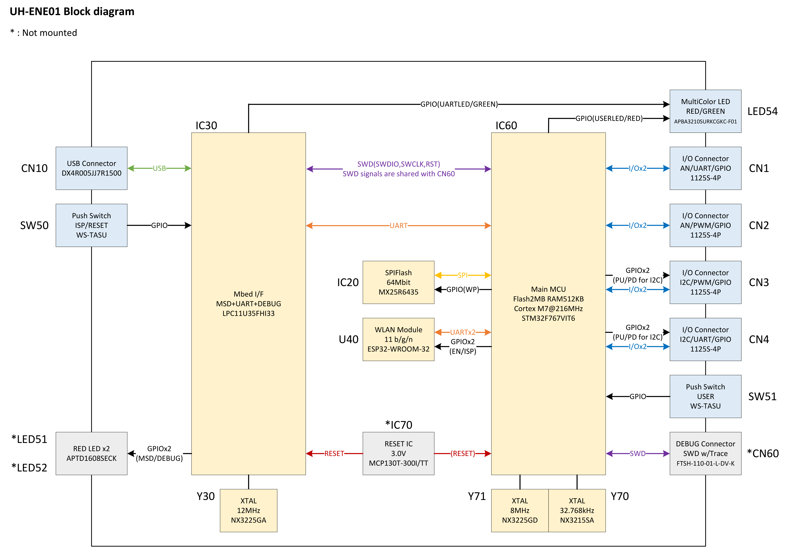
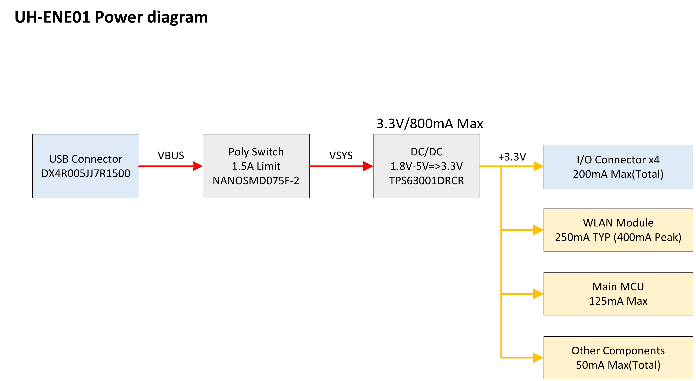

# RAVEN HardWare Specification

このページでは、RAVENのハードウェア詳細について説明します。

### Table of Contents

- [特徴](#Features)
- [一般仕様](#GeneralSpec)
- [技術資料](#TechnicalDocument)

## 特徴{#Features}
* MCUにSTM32F767を採用( Cortex®-M7@216MHz, 2MB Flash, 512KB SRAM )
* SPI接続の64Mbitフラッシュ
* WLAN( 802.11 b/g/n )モジュール
* ユーザー制御可能なスイッチとLED
* DAPLinkに対応
    * ドラッグアンドドロップ書き込み
    * USB仮想シリアルポート
    * CMSIS-DAP経由のデバッグ及び書き込み
* 4系統の多機能I/Oコネクタ
    * 3.3V動作のセンサ、及びアクチュエーターが使用可能
    * 各端子は複数の機能に対応( ADC/UART/I2C/PWM )
    * 各ポート50mA迄の電源供給

## 一般仕様{#GeneralSpec}

* 外形サイズ
    * 75mm x 35mm x 12mm( WxDxH )( 突起部を含まない )
* 定格
    * 5V/2.5W( microUSB端子にて電源供給 )
* 質量
    * 約22g

## 技術仕様{#TechnicalDocument}

* Portについて

* ブロック図

