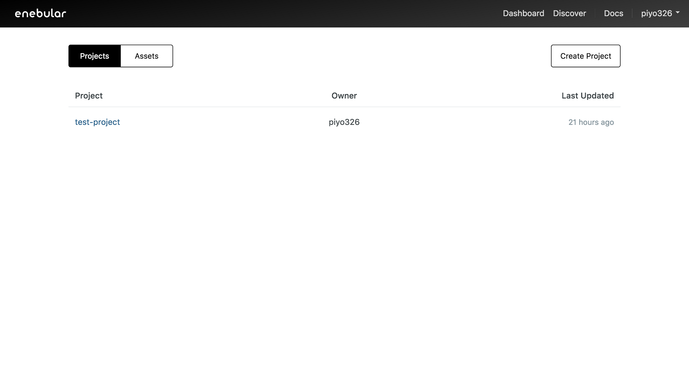
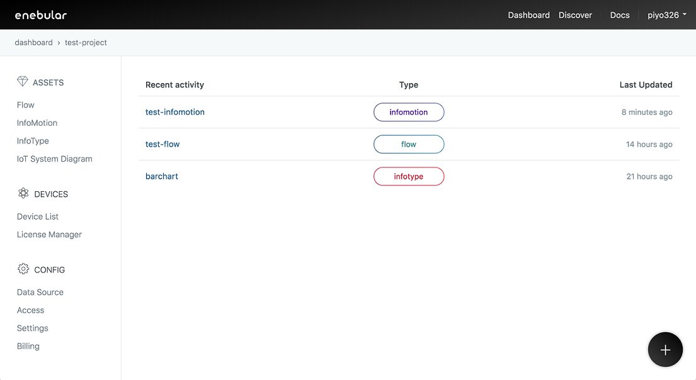
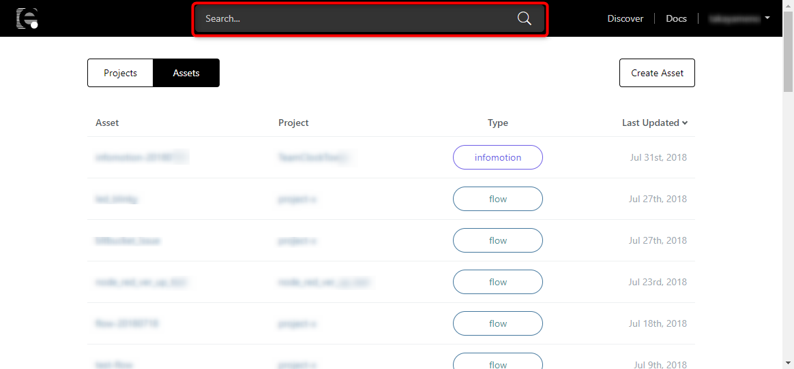

# Project

**Project** とは文字通りプロジェクトの単位です。[Introduction](../INDEX.md) でも触れたように、アセットやデバイスの管理ができます（画像内でデバイスがプロジェクトに含まれていないのは、デプロイされている実際の場所が外部のサービスの環境であるためです）。

サインイン後の画面でプロジェクト一覧を確認できます。`Create Project` からプロジェクトを作成できます。

プロジェクトを選択すると、プロジェクトの管理画面に移動します。

プロジェクトの管理画面には以下のようなページがあります。

## Assets

プロジェクト内で管理するコンテンツです。

- [Flow](../Flow/Introduction.md): Node-RED で作成したデータフロー
- [InfoMotion](../InfoMotion/Introduction.md): データの可視化を行うグラフダッシュボード
- [InfoType](../InfoMotion/InfoTypeIntroduction.md): InfoMotion で利用するグラフのタイプ

### Assets 検索

アカウントに紐づく Asset を、ページ上部の検索ボックスから検索することが出来ます。
検索結果はプロジェクトの管理画面に一覧表示されます。

検索ボックスからは Asset名 または Project名 で検索することが可能です。
Project名 で検索した場合、Project に紐づく Asset が一覧表示されます。

## Devices

プロジェクト内で管理するデバイスです。ここでいうデバイスとは Asset がデプロイされているデバイスを指します。

- [Device List](../Device/Introduction.md): デバイスの一覧
- Licence Manager: 有償機能を利用するためのライセンス管理

## Config

プロジェクトに関する設定です。

- [Data Source](../InfoMotion/CreateDataSource.md): グラフに利用するデータソースの登録
- [Access](../Access/index.md): プロジェクトのアクセスコントロール管理
- [Settings](../Project/Settings.md): プロジェクトの設定
- [Billing](../Project/Billing.md): 請求情報の管理